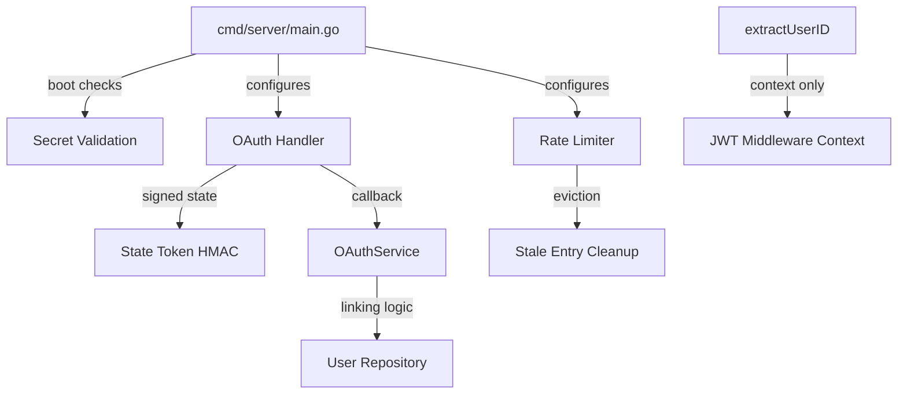

# Design: Auth & Secrets Hardening

## Overview

This design hardens the authentication and secrets infrastructure of the bakery platform. It ensures production deployments cannot start with insecure defaults, strengthens OAuth CSRF protection and account-linking safety, bounds rate-limiter memory, enforces cryptographic randomness for all tokens, and eliminates header-based identity fallbacks.

The codebase already has partial implementations for several of these concerns. This design documents the target state, identifies remaining gaps, and specifies tests to verify correctness.

---

## Architecture

The changes span the server startup path, OAuth handler/service layer, rate-limiting middleware, and identity extraction helpers. No new services or external dependencies are introduced.



---

## Components and Interfaces

### 1. Secret Validation (cmd/server/main.go)

**Current state**: The server already calls `log.Fatal` when `APP_ENV=production` and `JWT_SECRET` is empty. It also fatals when `STRIPE_WEBHOOK_SECRET` is empty in production with Stripe enabled.

**Target state**: Verify the existing checks are complete and cover both variables with clear error messages. No code changes needed if current implementation matches requirements.

```go
// Existing pattern (already in main.go):
if jwtSecret == "" {
    if appEnv == "production" {
        log.Fatal("FATAL: JWT_SECRET must be set in production. Refusing to start with default secret.")
    }
    jwtSecret = "dev-secret-do-not-use-in-production"
    log.Println("WARNING: Using default JWT secret. Set JWT_SECRET env var for production!")
}

// Stripe webhook (already in main.go):
if webhookSecret == "" {
    if appEnv == "production" {
        log.Fatal("FATAL: STRIPE_WEBHOOK_SECRET must be set in production when PAYMENT_GATEWAY=stripe.")
    }
}
```

### 2. OAuth State Token (internal/api/oauth_handler.go)

**Current state**: The handler already generates HMAC-signed state tokens with a nonce, timestamp, and 10-minute TTL. The callback verifies signature and expiry, returning HTTP 403 on failure.

**Target state**: Verify the implementation is correct and add property-based tests to validate the state token lifecycle.

**State token format**: `base64(nonce) + "." + hex(hmac(nonce + "|" + timestamp)) + "." + RFC3339(timestamp)`

```go
// Generation (already implemented):
func (h *OAuthHandler) generateOAuthState() (string, error) {
    nonce := make([]byte, 16)  // 128-bit nonce via crypto/rand
    // ... HMAC sign with stateKey, include timestamp
}

// Verification (already implemented):
func (h *OAuthHandler) verifyOAuthState(state string) bool {
    // Split into 3 parts, verify HMAC, check TTL
}
```

### 3. OAuth Account Linking (internal/service/oauth_service.go)

**Current state**: The service already checks `existingUser.PasswordHash != ""` and returns `ErrOAuthAccountLinkRequiresVerification` when a password-protected account is found. Social-only accounts (empty password hash) are auto-linked.

**Target state**: Verify the logic is correct via property tests. The decision tree:
- Existing social login for provider+userID: reuse (issue JWT)
- Existing user with password: reject (require password verification)
- Existing user without password: auto-link
- No existing user: create new account + link

### 4. Rate Limiter (internal/middleware/ratelimit.go)

**Current state**: 
- Auth rate limiter keys on `r.RemoteAddr` (not X-Forwarded-For)
- Both `/api/auth/login` and `/api/auth/register` use `authRateLimiter`
- `evictStale()` runs periodically (every 5x window duration) removing entries with no timestamps in the current window

**Target state**: Verify the implementation is correct via tests. The eviction logic should guarantee bounded memory growth.

```go
// Eviction logic (already implemented):
func (rl *RateLimiter) evictStale(now time.Time) {
    interval := rl.config.Window * cleanupMultiplier  // 5x window
    if now.Sub(rl.lastCleanup) < interval { return }
    // Remove entries where newest timestamp is before windowStart
}
```

### 5. Token Generation (internal/service/auth_service.go)

**Current state**: `generateTokenCode()` uses `crypto/rand.Int` with a 32-character alphabet producing 8-character codes (40 bits of entropy).

**Target state**: Verify no `math/rand` usage exists in security paths. The current implementation already meets requirements.

### 6. Identity Extraction (internal/api/helpers.go)

**Current state**: `extractUserID()` delegates to `middleware.GetUserIDFromContext()` which reads only from the JWT context key. No X-User-ID header fallback exists.

**Target state**: Verify via test that the function ignores headers and returns empty string when no context is set.

---

## Data Models

No new data models are introduced. This is a hardening ticket affecting existing control flow, not data persistence.

---

## Correctness Properties

*A property is a characteristic or behavior that should hold true across all valid executions of a system — essentially, a formal statement about what the system should do. Properties serve as the bridge between human-readable specifications and machine-verifiable correctness guarantees.*

### Property 1: OAuth state token structural integrity

*For any* generated OAuth state token, the token SHALL consist of exactly three dot-separated parts: a valid base64url-encoded nonce (16 bytes), a valid hex-encoded HMAC-SHA256 signature, and a valid RFC3339 timestamp.

**Validates: Requirements 2.1**

### Property 2: OAuth state token tamper detection

*For any* valid OAuth state token, if any single character in any of its three components (nonce, signature, or timestamp) is modified, `verifyOAuthState` SHALL return false.

**Validates: Requirements 2.2**

### Property 3: OAuth state token expiry enforcement

*For any* OAuth state token generated at time T, `verifyOAuthState` called at time T + delta SHALL return true if and only if delta <= 10 minutes.

**Validates: Requirements 2.3**

### Property 4: OAuth account linking decision

*For any* OAuth callback with email E:
- If an account exists with username E and a non-empty password hash, the service SHALL return `ErrOAuthAccountLinkRequiresVerification`.
- If an account exists with username E and an empty password hash, the service SHALL link the provider and return success.
- If no account exists with username E, the service SHALL create a new account and return success.

**Validates: Requirements 3.1, 3.2, 3.3**

### Property 5: Rate limiter keys on RemoteAddr

*For any* HTTP request with arbitrary X-Forwarded-For header values, the auth rate limiter SHALL use only `r.RemoteAddr` as the bucket key, meaning requests from different RemoteAddr values are rate-limited independently regardless of header content.

**Validates: Requirements 4.1**

### Property 6: Rate limiter stale entry eviction

*For any* set of rate-limited keys, if no requests arrive for a key within window + 5x-window (eviction interval), the key's entry SHALL be removed from the map, bounding total map size to the number of active clients.

**Validates: Requirements 4.3**

### Property 7: Registration token entropy

*For any* generated registration token code, the code SHALL be exactly 8 characters long, each character drawn from the alphabet "ABCDEFGHJKLMNPQRSTUVWXYZ23456789" (32 symbols, yielding >= 40 bits of entropy).

**Validates: Requirements 5.1, 5.3**

### Property 8: Identity extraction ignores headers

*For any* HTTP request carrying an X-User-ID header with any non-empty value but no JWT-authenticated context, `extractUserID` SHALL return an empty string.

**Validates: Requirements 6.1, 6.2, 6.3**

---

## Error Handling

| Scenario | Response |
|----------|----------|
| Missing JWT_SECRET in production | Process exits with `log.Fatal`, non-zero exit code |
| Missing STRIPE_WEBHOOK_SECRET in production+stripe | Process exits with `log.Fatal`, non-zero exit code |
| Invalid/expired OAuth state | HTTP 403, code `INVALID_STATE` |
| OAuth email matches password-protected account | HTTP 409, code `ACCOUNT_LINK_REQUIRES_VERIFICATION` |
| Rate limit exceeded | HTTP 429, code `RATE_LIMITED` |
| crypto/rand failure in token generation | Panic (unrecoverable — process should crash) |

---

## Testing Strategy

### Unit Tests (example-based)

- **Boot checks**: Test startup logic with various env var combinations (requires process-spawning or refactoring startup into a testable function).
- **Rate limit response format**: Verify HTTP 429 response body matches expected JSON structure.
- **Register rate limiting**: Integration test verifying `/api/auth/register` is rate-limited.

### Property-Based Tests (fast-check style, minimum 100 iterations)

All properties above are testable via Go's `testing/quick` package or a PBT library like `github.com/leanovate/gopter`. Each property test should:
- Run at least 100 iterations with randomly generated inputs
- Be tagged with the property number and requirement reference
- Focus on the pure logic functions (state token generation/verification, account linking decision, rate limiter keying, token generation, identity extraction)

### Static Analysis

- `go vet` + `staticcheck` to verify no `math/rand` imports in security-sensitive packages
- CI lint rule: flag any import of `math/rand` in `internal/auth/`, `internal/service/auth_service.go`, `internal/middleware/`

### Test File Organization

| Property | Test File |
|----------|-----------|
| Properties 1-3 (OAuth state) | `internal/api/oauth_handler_test.go` |
| Property 4 (account linking) | `internal/service/oauth_service_test.go` |
| Properties 5-6 (rate limiter) | `internal/middleware/ratelimit_test.go` |
| Property 7 (token entropy) | `internal/service/auth_service_test.go` |
| Property 8 (identity extraction) | `internal/api/helpers_test.go` |
