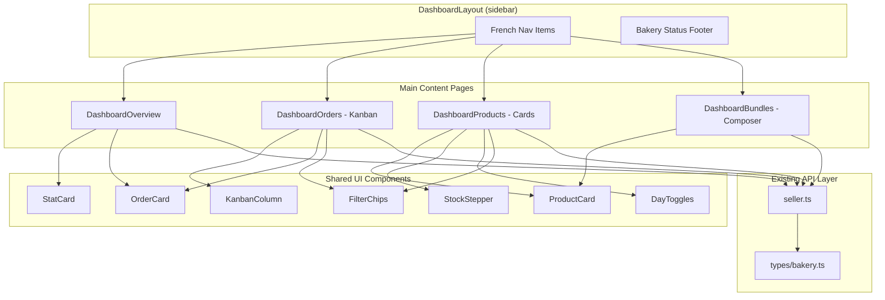

# Design Document: Baker Portal Redesign

## Overview

This redesign transforms the existing baker's Pro portal from a generic English table-based UI into a French-language, card-based, kanban-style interface that matches the "Mie & Beurre" brand identity. The portal consists of four main screens: a morning dashboard overview ("le fournil"), a kanban-based order management board, a card-based product/stock manager with inline editing, and a bundle composer for evening anti-gaspi baskets.

The redesign keeps the existing React + TypeScript + Vite stack, existing API endpoints, and the sidebar layout structure. It rebuilds the main content areas of each page to use cards, chips, and drag-drop interactions instead of HTML tables. All UI text is in French.

## Architecture



## Components and Interfaces

### Component 1: DashboardLayout (Sidebar Refinement)

**Purpose**: Minor update to the existing sidebar — correct nav labels to French, match nav items to mockup design.

**Interface**:
```typescript
// Nav items configuration — updated to match mockup
const NAV_ITEMS = [
  { to: '/dashboard', label: 'Tableau de bord', icon: '📊', end: true },
  { to: '/dashboard/orders', label: 'Commandes', icon: '📦', end: false, badge: orderCount },
  { to: '/dashboard/products', label: 'Menu & stock', icon: '🥐', end: false },
  { to: '/dashboard/bundles', label: 'Paniers du soir', icon: '🌙', end: false },
  { to: '/dashboard/stats', label: 'Statistiques', icon: '📈', end: false },
  { to: '/dashboard/bakery', label: 'Boutique', icon: '🏪', end: false },
];
```

**Responsibilities**:
- Render the dark sidebar with "Mie & Beurre Pro" italic branding
- Show active nav item as blue pill (#4b8fe8)
- Display order count badge on Commandes
- Show bakery avatar + name + "Ouvert · 7–19" status in footer

---

### Component 2: DashboardOverview (Morning Dashboard)

**Purpose**: Rebuild the morning overview with KPI stat cards, a "to prepare" order list, low-stock alert, and anti-gaspi CTA card.

**Interface**:
```typescript
interface StatCardProps {
  label: string;
  value: string | number;
  subtitle: string;
  badge?: { text: string; variant: 'positive' | 'neutral' };
}

interface OrderCardProps {
  orderId: string;
  time: string;          // formatted HH:MM
  items: string;         // e.g. "2× croissant, 1× pain"
  type: 'livraison' | 'retrait';
  customerName?: string;
  price?: number;
  status: OrderStatus;
  onAction?: (newStatus: OrderStatus) => void;
}
```

**Layout** (2-column grid):
```
┌─────────────────────────────────────────────┐
│ Header: "Bonjour [name] ☀️ [date]"         │
│                          [Boutique toggle]   │
├─────────────────────────────────────────────┤
│ [Stat Card 1] [Stat Card 2] [Stat Card 3]  │
├──────────────────────┬──────────────────────┤
│ À préparer maintenant│ Stock faible ⚠️      │
│ (order cards list)   │ (product names)      │
├──────────────────────┴──────────────────────┤
│ 🌙 Panier du soir (golden anti-gaspi CTA)  │
└─────────────────────────────────────────────┘
```

**Responsibilities**:
- Fetch today's orders, reservations, products on mount
- Compute KPI metrics (order count, next reservation time, revenue)
- Display "À préparer maintenant" section with order cards
- Show low-stock warning with product names in red
- Show golden anti-gaspi card with estimated unsold value and CTA

---

### Component 3: DashboardOrders (Kanban Board)

**Purpose**: Complete rebuild from table to a 4-column kanban board with drag-and-drop.

**Interface**:
```typescript
type OrderStatus = 'confirmed' | 'preparing' | 'ready' | 'delivered';

interface KanbanColumn {
  id: OrderStatus;
  label: string;       // "À PRÉPARER", "EN PRÉPARATION", "PRÊT", "REMIS / LIVRÉ"
  orders: Order[];
}

interface OrderFilterState {
  type: 'all' | 'livraison' | 'retrait';
}

// Drag-and-drop state
interface DragState {
  draggedOrderId: string | null;
  sourceColumn: OrderStatus | null;
  targetColumn: OrderStatus | null;
}
```

**Layout**:
```
┌─────────────────────────────────────────────────────┐
│ Header: "Commandes — mercredi"  [Aujourd'hui ▾]     │
│ Filter chips: [Livraison] [Retrait] [Toutes (active)]│
├────────────┬────────────┬────────────┬──────────────┤
│ À PRÉPARER │EN PRÉPARAT.│    PRÊT    │ REMIS/LIVRÉ  │
│    (6)     │    (2)     │    (3)     │    (7)       │
├────────────┼────────────┼────────────┼──────────────┤
│ [card]     │ [card]     │ [card]     │ [card]       │
│ [card]     │ [card]     │            │ [card]       │
│ [card]     │            │            │              │
└────────────┴────────────┴────────────┴──────────────┘
```

**Responsibilities**:
- Fetch all today's orders and group by status into 4 columns
- Support HTML5 drag-and-drop between adjacent columns
- Apply filter chips (Livraison, Retrait, Toutes)
- Show action buttons on cards: "Commencer", "Prêt ✓", "Remis ✓"
- Blue border highlight on "EN PRÉPARATION" cards
- Call `updateOrderStatus` API when moving cards
- Notify customer when order moves to "Prêt" (via existing API)

---

### Component 4: DashboardProducts (Card-Based Inventory)

**Purpose**: Complete rebuild from table to card-based product manager with inline stock editing, category filter chips, and day availability toggles.

**Interface**:
```typescript
interface ProductCardProps {
  product: Product;
  onStockChange: (productId: string, delta: number) => void;
  onToggleVisibility: (productId: string) => void;
}

interface StockStepperProps {
  value: number;
  onChange: (newValue: number) => void;
  lowThreshold?: number;   // turns red below this
}

interface DayToggleProps {
  activeDays: string[];    // ['L', 'M', 'M', 'J', 'V', 'S', 'D']
  onChange: (days: string[]) => void;
}

type ProductCategory = 'viennoiseries' | 'pains' | 'pâtisseries';
```

**Layout**:
```
┌──────────────────────────────────────────────────────┐
│ Header: "Menu & stock"                               │
│ [Viennoiseries] [Pains] [Pâtisseries]  [+ Nouveau]  │
├──────────────────────────────────────────────────────┤
│ ┌──────────┐ ┌──────────┐ ┌──────────┐              │
│ │ [photo]  │ │ [photo]  │ │ [photo]  │              │
│ │ name     │ │ name     │ │ name     │              │
│ │ desc     │ │ desc     │ │ desc     │              │
│ │ €price   │ │ €price   │ │ €price   │              │
│ │ [−][5][+]│ │ [−][3][+]│ │ [−][0][+]│ ← red       │
│ │ [en vente]│ │ [masqué] │ │ [en vente]│             │
│ └──────────┘ └──────────┘ └──────────┘              │
├──────────────────────────────────────────────────────┤
│ Availability: [L][M][M][J][V][S][D]                  │
│ "le stock se remet à zéro chaque soir ↺"            │
└──────────────────────────────────────────────────────┘
```

**Responsibilities**:
- Fetch products and group by category
- Display as cards with photo, name, description, allergens, price
- Inline −/+ stock stepper with current count (red when low)
- "en vente"/"masqué" toggle badge per product (dimmed when hidden)
- Category filter chips at the top
- "+ Nouveau produit" blue button opens product creation form
- Day availability toggles (L M M J V S D) at bottom
- Note: "le stock se remet à zéro chaque soir ↺"

---

### Component 5: DashboardBundles (Evening Bundle Composer)

**Purpose**: Complete rebuild from table-based reservations view to a split-panel bundle composer for anti-gaspi baskets.

**Interface**:
```typescript
interface BundleProduct {
  productId: string;
  name: string;
  remaining: number;
  selected: boolean;
  quantity: number;
}

interface BundlePreview {
  name: string;           // e.g. "Panier Colette"
  pickupTime: string;     // e.g. "18:30–19:00"
  items: BundleProduct[];
  originalPrice: number;  // cents
  discountedPrice: number; // cents
  quantity: number;        // number of baskets
}

interface BundleComposerState {
  products: BundleProduct[];
  preview: BundlePreview;
  pickupStart: string;
  pickupEnd: string;
  basketCount: number;
}
```

**Layout** (split panel):
```
┌─────────────────────────────────────────────────────────────┐
│ Header: "Paniers du soir" [anti-gaspi badge]                │
│ "fermeture 19:00 · publication conseillée avant 17:30"      │
├──────────────────────────────┬──────────────────────────────┤
│ 1 · Invendus du jour         │ Aperçu client               │
│ ☑ Croissant amande (reste 3)│ ┌────────────────────────┐   │
│   [−][2][+]                  │ │ Panier Colette         │   │
│ ☑ Pain complet (reste 2)    │ │ retrait 18:30–19       │   │
│   [−][1][+]                  │ │ • 2× Croissant amande  │   │
│ ☐ Éclair café (reste 1)     │ │ • 1× Pain complet      │   │
│                              │ │ ~~€8.50~~ → €5.00     │   │
│                              │ │ [Réserver]             │   │
│                              │ └────────────────────────┘   │
│                              │ Prix: €5.00                  │
│                              │ Quantité: [−][3][+] paniers  │
│                              │ Retrait: [18:30] — [19:00]   │
├──────────────────────────────┴──────────────────────────────┤
│                  [Publier les paniers]                       │
└─────────────────────────────────────────────────────────────┘
```

**Responsibilities**:
- Fetch today's products with remaining stock
- Display as checklist with checkboxes (checked = blue) and "reste X" labels
- Quantity controls (−/+) per selected product
- Live preview panel showing what customer will see
- Calculate original vs. discounted price
- Basket count stepper and pickup time selector
- "Publier les paniers" button to publish (calls existing reservation/bundle API)
- Warm cream palette for client preview card
- Golden anti-gaspi badge styling

---

### Component 6: FilterChips (Shared)

**Purpose**: Reusable chip-based filter component used in Orders and Products pages.

**Interface**:
```typescript
interface FilterChipsProps<T extends string> {
  options: { value: T; label: string }[];
  selected: T;
  onChange: (value: T) => void;
  variant?: 'default' | 'category';
}
```

**Responsibilities**:
- Render horizontal row of chip buttons
- Active chip = filled blue (#4b8fe8), inactive = outlined
- Click to select (single selection)

---

### Component 7: StatCard (Shared)

**Purpose**: KPI stat card used on the overview dashboard.

**Interface**:
```typescript
interface StatCardProps {
  label: string;
  value: string | number;
  subtitle: string;
  badge?: { text: string; variant: 'positive' | 'neutral' | 'negative' };
}
```

**Responsibilities**:
- White card with rounded corners
- Large value display, muted label above, subtitle below
- Optional badge (e.g., "+12% vs mer. dernier" in green)

---

### Component 8: StockStepper (Shared)

**Purpose**: Inline −/+ number input for stock quantities.

**Interface**:
```typescript
interface StockStepperProps {
  value: number;
  min?: number;
  max?: number;
  onChange: (newValue: number) => void;
  danger?: boolean;  // red styling when stock is low
}
```

**Responsibilities**:
- Display current value between − and + buttons
- Turn red when `danger` is true (low stock)
- Prevent going below min (default 0)

## Data Models

### Order (existing, no changes needed)

```typescript
// From types/order.ts — ScheduleEntry
interface ScheduleEntry {
  id: string;
  type: 'order' | 'reservation';
  status: string;
  scheduledTime: string;
  totalAmount: number;
  customerName?: string;
  items: { productId: string; productName: string; quantity: number; unitPrice: number }[];
}
```

### Product (existing, no changes needed)

```typescript
interface Product {
  id: string;
  bakeryId: string;
  name: string;
  description: string;
  price: number;       // cents
  photoUrl: string;
  category: string;
  isAvailable: boolean;
  allergens: string[];
  healthScore: number | null;
}
```

### Bundle (new local state model)

```typescript
interface Bundle {
  id?: string;
  bakeryId: string;
  name: string;
  items: { productId: string; quantity: number }[];
  originalPrice: number;   // cents
  discountedPrice: number; // cents
  basketCount: number;
  pickupStart: string;     // "HH:MM"
  pickupEnd: string;       // "HH:MM"
  publishedAt?: string;
}
```

**Validation Rules**:
- Bundle must have at least 1 item selected
- Discounted price must be less than original price
- Pickup time window must be before bakery closing time
- Basket count must be ≥ 1
- Item quantity cannot exceed remaining stock

## Error Handling

### Error Scenario 1: API fetch failure

**Condition**: Network error or server error when loading orders/products/reservations
**Response**: Display inline error message in French, retain any previously loaded data
**Recovery**: Show a "Réessayer" (retry) button; auto-retry on reconnect

### Error Scenario 2: Drag-drop to invalid column

**Condition**: User tries to skip a kanban column (e.g., "À préparer" directly to "Remis")
**Response**: Snap card back to original position, show brief toast explaining valid transitions
**Recovery**: No data mutation occurs; card returns to source column

### Error Scenario 3: Stock update conflict

**Condition**: Another user updated stock while baker was editing
**Response**: Show stale-data warning, refresh product data
**Recovery**: Reload products from API, apply conflict resolution (latest wins)

### Error Scenario 4: Bundle publish with no items

**Condition**: Baker clicks "Publier" without selecting any products
**Response**: Disable "Publier" button when no items selected, show helper text
**Recovery**: Button becomes active once at least one item is checked

## Testing Strategy

### Unit Testing Approach

- Test each shared component (FilterChips, StatCard, StockStepper, OrderCard) in isolation
- Test kanban column ordering logic and filter chip selection
- Test bundle price calculation and validation logic
- Test drag-and-drop state transitions
- Framework: Vitest + React Testing Library (co-located `.test.tsx` files)

### Property-Based Testing Approach

- Test that kanban column grouping correctly partitions all orders (no duplicates, no losses)
- Test that bundle price calculation always satisfies: discountedPrice < originalPrice when items selected
- Test that stock stepper values remain bounded within [0, max]
- **Property Test Library**: fast-check (already in devDependencies)

### Integration Testing Approach

- Test full page renders with mocked API responses
- Test drag-and-drop flow updates order status correctly
- Test bundle composer end-to-end: select items → preview updates → publish

## Performance Considerations

- Kanban board: Only load today's orders (not historical) — history lives in Statistiques
- Products page: Lazy-load product images with placeholder
- Bundle composer: Debounce price recalculation on quantity changes
- Use `React.memo` on OrderCard and ProductCard to prevent unnecessary re-renders during drag operations

## Security Considerations

- All API calls use existing authenticated seller endpoints
- No new endpoints needed — reuse `/bakeries/:id/orders`, `/bakeries/:id/products`
- Stock updates use `updateProduct` API which already validates bakery ownership
- Bundle publishing uses existing reservation creation flow with seller auth

## Dependencies

- **Existing**: React 19, react-router-dom 7, TypeScript, Vitest, React Testing Library, fast-check
- **No new dependencies** — drag-and-drop uses HTML5 native API (no library needed for 4-column kanban)
- **CSS**: All styling via CSS custom properties defined in pro-theme.css (already exists)

## Correctness Properties

*A property is a characteristic or behavior that should hold true across all valid executions of a system — essentially, a formal statement about what the system should do. Properties serve as the bridge between human-readable specifications and machine-verifiable correctness guarantees.*

### Property 1: Kanban order conservation

*For any* set of today's orders, grouping them into kanban columns SHALL produce exactly the same set of orders — no order is duplicated across columns, and no order is lost.

**Validates: Requirements 3.2**

### Property 2: Kanban column assignment by status

*For any* order, the order SHALL appear in the column matching its status — confirmed → "À préparer", preparing → "En préparation", ready → "Prêt", delivered → "Remis / Livré".

**Validates: Requirements 3.2**

### Property 3: Filter chip consistency

*For any* combination of orders and a selected filter type, the displayed orders SHALL be a subset of the full order set where all displayed orders match the filter criteria.

**Validates: Requirements 3.5, 4.7**

### Property 4: Stock stepper bounds

*For any* sequence of increment/decrement operations on a stock stepper, the displayed value SHALL always remain within [min, max] bounds.

**Validates: Requirements 6.4, 5.10**

### Property 5: Bundle price discount invariant

*For any* bundle with at least one item selected, the discounted price SHALL always be strictly less than the sum of original item prices.

**Validates: Requirements 5.6**

### Property 6: Bundle item quantity bounds

*For any* product in the bundle composer, the selected quantity SHALL never exceed the remaining stock for that product, and SHALL never be less than 0.

**Validates: Requirements 5.4**
