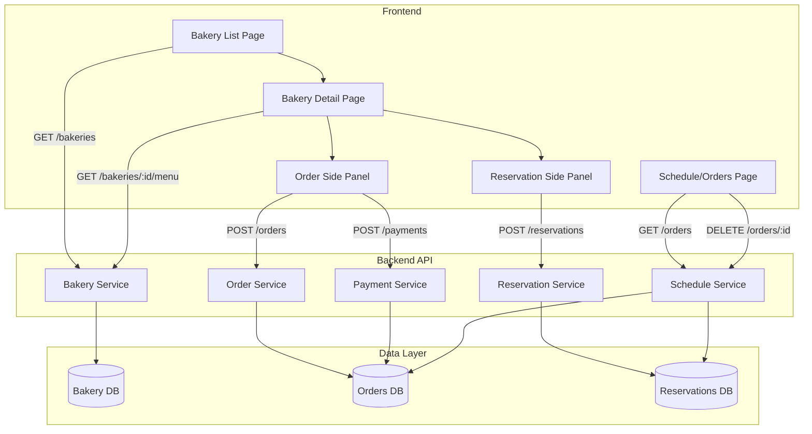
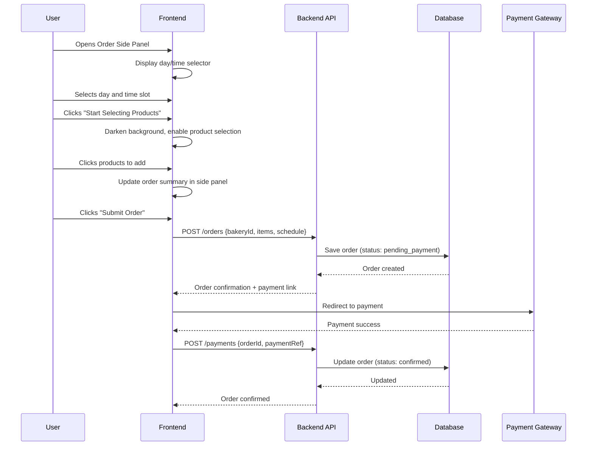
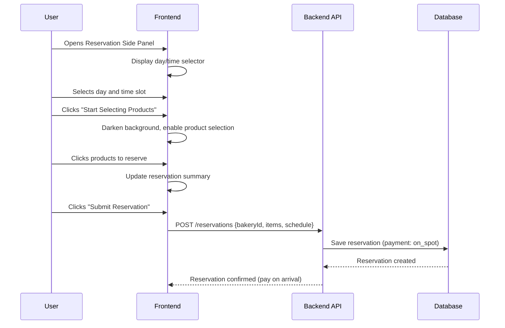

# Design Document: Bakery Ordering & Reservation App

## Overview

The Bakery Ordering & Reservation App is a modern, round-styled web application that enables users to browse bakeries, explore menus, place orders for delivery, and make reservations for pickup. The system features a card-based bakery listing, detailed menu exploration with interactive product selection, side-panel-driven ordering and reservation workflows, and a schedule/orders management page.

The application follows a component-based frontend architecture with a RESTful API backend. The UI emphasizes rounded, modern aesthetics with smooth transitions, overlay-driven product selection, and side panels for order/reservation workflows. Payment is handled online for delivery orders and on-the-spot for reservations.

## Architecture



## Sequence Diagrams

### Order Placement Flow



### Reservation Flow



## Components and Interfaces

### Component 1: BakeryListPage

**Purpose**: Displays all bakeries as rounded cards with photo, name, and today's schedule.

```pascal
INTERFACE BakeryListPage
  PROCEDURE render()
    OUTPUT: Rendered page with bakery cards
  
  PROCEDURE fetchBakeries()
    OUTPUT: List of Bakery objects
  
  PROCEDURE navigateToBakery(bakeryId: UUID)
    INPUT: bakeryId
    OUTPUT: Navigation to bakery detail page
END INTERFACE
```

**Responsibilities**:
- Fetch and display bakery list on page load
- Render each bakery as a rounded card (photo, name, schedule)
- Handle card click to navigate to bakery detail

### Component 2: BakeryDetailPage

**Purpose**: Shows bakery menu with modern decoration, enables ordering and reservation.

```pascal
INTERFACE BakeryDetailPage
  PROCEDURE render(bakeryId: UUID)
    OUTPUT: Rendered bakery detail with menu
  
  PROCEDURE fetchMenu(bakeryId: UUID)
    OUTPUT: List of Product objects grouped by category
  
  PROCEDURE openOrderPanel()
    OUTPUT: Side panel opens for ordering
  
  PROCEDURE openReservationPanel()
    OUTPUT: Side panel opens for reservation
END INTERFACE
```

**Responsibilities**:
- Display bakery info and menu items in modern layout
- Provide access to order and reservation side panels
- Support product browsing by category

### Component 3: OrderSidePanel

**Purpose**: Side panel for creating delivery orders with schedule and product selection.

```pascal
INTERFACE OrderSidePanel
  PROCEDURE open()
    OUTPUT: Panel slides in from right side
  
  PROCEDURE close()
    OUTPUT: Panel slides out, resets state
  
  PROCEDURE selectDay(day: DayOfWeek)
    INPUT: day (Monday..Sunday)
    OUTPUT: Updates selected day
  
  PROCEDURE selectTimeSlot(slot: TimeSlot)
    INPUT: time slot
    OUTPUT: Updates selected time
  
  PROCEDURE enterProductSelection()
    OUTPUT: Background darkens, product selection mode enabled
  
  PROCEDURE addProduct(product: Product, quantity: Integer)
    INPUT: product, quantity
    OUTPUT: Product added to order items
  
  PROCEDURE removeProduct(productId: UUID)
    INPUT: productId
    OUTPUT: Product removed from order items
  
  PROCEDURE submitOrder()
    OUTPUT: Order submitted to backend, redirects to payment
END INTERFACE
```

**Responsibilities**:
- Manage order workflow (schedule → product selection → submit)
- Track selected items and quantities
- Validate order before submission
- Trigger payment flow on submit

### Component 4: ReservationSidePanel

**Purpose**: Side panel for creating reservations with schedule and product selection.

```pascal
INTERFACE ReservationSidePanel
  PROCEDURE open()
    OUTPUT: Panel slides in from right side
  
  PROCEDURE close()
    OUTPUT: Panel slides out, resets state
  
  PROCEDURE selectDay(day: DayOfWeek)
    INPUT: day (Monday..Sunday)
    OUTPUT: Updates selected day
  
  PROCEDURE selectTimeSlot(slot: TimeSlot)
    INPUT: time slot
    OUTPUT: Updates selected time
  
  PROCEDURE enterProductSelection()
    OUTPUT: Background darkens, product selection mode enabled
  
  PROCEDURE addProduct(product: Product, quantity: Integer)
    INPUT: product, quantity
    OUTPUT: Product added to reservation items
  
  PROCEDURE submitReservation()
    OUTPUT: Reservation submitted (payment on spot)
END INTERFACE
```

**Responsibilities**:
- Manage reservation workflow (schedule → product selection → submit)
- Track selected items for pickup
- Confirm reservation without online payment

### Component 5: ScheduleOrdersPage

**Purpose**: Table view of all orders and reservations with management capabilities.

```pascal
INTERFACE ScheduleOrdersPage
  PROCEDURE render()
    OUTPUT: Table of orders/reservations
  
  PROCEDURE fetchOrders(filters: OrderFilters)
    OUTPUT: Filtered list of orders
  
  PROCEDURE deleteOrder(orderId: UUID)
    INPUT: orderId
    OUTPUT: Order removed from system
  
  PROCEDURE viewOrderDetails(orderId: UUID)
    INPUT: orderId
    OUTPUT: Expanded order detail view
END INTERFACE
```

**Responsibilities**:
- Display orders in tabular format (items, time, status)
- Support filtering and sorting
- Enable order deletion and status management

### Component 6: ProductSelectionOverlay

**Purpose**: Darkened overlay that enables clicking on products to add them to order/reservation.

```pascal
INTERFACE ProductSelectionOverlay
  PROCEDURE activate(targetPanel: SidePanelType)
    INPUT: which panel triggered selection
    OUTPUT: Background darkens, products become clickable
  
  PROCEDURE deactivate()
    OUTPUT: Overlay removed, normal view restored
  
  PROCEDURE onProductClick(product: Product)
    INPUT: clicked product
    OUTPUT: Product added to active panel's item list
END INTERFACE
```

**Responsibilities**:
- Darken background when product selection is active
- Handle product clicks and relay to active side panel
- Provide visual feedback on selected products

## Data Models

### Bakery

```pascal
STRUCTURE Bakery
  id: UUID
  name: String
  photoUrl: String
  description: String
  address: String
  schedule: List OF DaySchedule
  createdAt: DateTime
END STRUCTURE

STRUCTURE DaySchedule
  day: DayOfWeek
  openTime: Time
  closeTime: Time
  isOpen: Boolean
END STRUCTURE

ENUMERATION DayOfWeek
  Monday, Tuesday, Wednesday, Thursday, Friday, Saturday, Sunday
END ENUMERATION
```

**Validation Rules**:
- name must be non-empty, max 100 characters
- photoUrl must be a valid URL
- schedule must contain exactly 7 entries (one per day)
- openTime must be before closeTime when isOpen is true

### Product

```pascal
STRUCTURE Product
  id: UUID
  bakeryId: UUID
  name: String
  description: String
  price: Decimal
  photoUrl: String
  category: String
  isAvailable: Boolean
END STRUCTURE
```

**Validation Rules**:
- price must be positive (> 0)
- name must be non-empty, max 100 characters
- category must be non-empty

### Order

```pascal
STRUCTURE Order
  id: UUID
  bakeryId: UUID
  userId: UUID
  items: List OF OrderItem
  scheduledDay: DayOfWeek
  scheduledTime: TimeSlot
  status: OrderStatus
  totalAmount: Decimal
  paymentMethod: PaymentMethod
  createdAt: DateTime
  updatedAt: DateTime
END STRUCTURE

STRUCTURE OrderItem
  productId: UUID
  productName: String
  quantity: Integer
  unitPrice: Decimal
  subtotal: Decimal
END STRUCTURE

STRUCTURE TimeSlot
  startTime: Time
  endTime: Time
END STRUCTURE

ENUMERATION OrderStatus
  PendingPayment, Confirmed, Preparing, Ready, Delivered, Cancelled
END ENUMERATION

ENUMERATION PaymentMethod
  Online, OnSpot
END ENUMERATION
```

**Validation Rules**:
- items must contain at least one item
- quantity must be positive integer (>= 1)
- subtotal must equal quantity × unitPrice
- totalAmount must equal sum of all item subtotals
- scheduledTime must fall within bakery operating hours for scheduledDay

### Reservation

```pascal
STRUCTURE Reservation
  id: UUID
  bakeryId: UUID
  userId: UUID
  items: List OF OrderItem
  scheduledDay: DayOfWeek
  scheduledTime: TimeSlot
  status: ReservationStatus
  totalAmount: Decimal
  paymentMethod: PaymentMethod  -- Always OnSpot
  createdAt: DateTime
END STRUCTURE

ENUMERATION ReservationStatus
  Confirmed, Ready, PickedUp, Cancelled
END ENUMERATION
```

**Validation Rules**:
- paymentMethod must always be OnSpot for reservations
- items must contain at least one item
- scheduledTime must fall within bakery operating hours

## Algorithmic Pseudocode

### Main Algorithm: Submit Order

```pascal
ALGORITHM submitOrder(orderRequest)
INPUT: orderRequest of type OrderRequest
OUTPUT: result of type OrderResult

BEGIN
  -- Precondition: User is authenticated
  ASSERT user IS authenticated
  
  -- Step 1: Validate the order request
  validation ← validateOrderRequest(orderRequest)
  IF validation.hasErrors THEN
    RETURN OrderResult.Error(validation.errors)
  END IF
  
  -- Step 2: Verify product availability
  FOR each item IN orderRequest.items DO
    ASSERT item.quantity > 0
    product ← fetchProduct(item.productId)
    IF product IS NULL OR NOT product.isAvailable THEN
      RETURN OrderResult.Error("Product unavailable: " + item.productId)
    END IF
  END FOR
  
  -- Step 3: Verify schedule is within bakery hours
  bakery ← fetchBakery(orderRequest.bakeryId)
  daySchedule ← bakery.schedule[orderRequest.scheduledDay]
  IF NOT daySchedule.isOpen THEN
    RETURN OrderResult.Error("Bakery closed on selected day")
  END IF
  IF NOT isWithinHours(orderRequest.scheduledTime, daySchedule) THEN
    RETURN OrderResult.Error("Selected time outside operating hours")
  END IF
  
  -- Step 4: Calculate total
  total ← 0
  FOR each item IN orderRequest.items DO
    product ← fetchProduct(item.productId)
    item.unitPrice ← product.price
    item.subtotal ← item.quantity * item.unitPrice
    total ← total + item.subtotal
    ASSERT total >= 0
  END FOR
  
  -- Step 5: Create order
  order ← createOrder(orderRequest, total, OrderStatus.PendingPayment)
  saveOrder(order)
  
  -- Step 6: Initiate payment
  paymentLink ← initiatePayment(order.id, total)
  
  RETURN OrderResult.Success(order, paymentLink)
END
```

**Preconditions:**
- User is authenticated with valid session
- orderRequest contains valid bakeryId, items, and schedule
- All referenced products exist in the system

**Postconditions:**
- Order is persisted with status PendingPayment
- Payment link is generated and returned
- Total amount equals sum of all item subtotals

**Loop Invariants:**
- Product availability loop: all previously checked products were available
- Total calculation loop: running total equals sum of processed item subtotals

### Algorithm: Submit Reservation

```pascal
ALGORITHM submitReservation(reservationRequest)
INPUT: reservationRequest of type ReservationRequest
OUTPUT: result of type ReservationResult

BEGIN
  -- Precondition: User is authenticated
  ASSERT user IS authenticated
  
  -- Step 1: Validate the reservation request
  validation ← validateReservationRequest(reservationRequest)
  IF validation.hasErrors THEN
    RETURN ReservationResult.Error(validation.errors)
  END IF
  
  -- Step 2: Verify product availability
  FOR each item IN reservationRequest.items DO
    product ← fetchProduct(item.productId)
    IF product IS NULL OR NOT product.isAvailable THEN
      RETURN ReservationResult.Error("Product unavailable: " + item.productId)
    END IF
  END FOR
  
  -- Step 3: Verify schedule
  bakery ← fetchBakery(reservationRequest.bakeryId)
  daySchedule ← bakery.schedule[reservationRequest.scheduledDay]
  IF NOT daySchedule.isOpen THEN
    RETURN ReservationResult.Error("Bakery closed on selected day")
  END IF
  IF NOT isWithinHours(reservationRequest.scheduledTime, daySchedule) THEN
    RETURN ReservationResult.Error("Time outside operating hours")
  END IF
  
  -- Step 4: Calculate total
  total ← 0
  FOR each item IN reservationRequest.items DO
    product ← fetchProduct(item.productId)
    item.unitPrice ← product.price
    item.subtotal ← item.quantity * item.unitPrice
    total ← total + item.subtotal
  END FOR
  
  -- Step 5: Create reservation (payment on spot)
  reservation ← createReservation(
    reservationRequest, total, 
    ReservationStatus.Confirmed, PaymentMethod.OnSpot
  )
  saveReservation(reservation)
  
  RETURN ReservationResult.Success(reservation)
END
```

**Preconditions:**
- User is authenticated with valid session
- reservationRequest contains valid bakeryId, items, and schedule

**Postconditions:**
- Reservation is persisted with status Confirmed
- Payment method is always OnSpot
- No online payment is initiated

**Loop Invariants:**
- All previously checked products were available and had valid prices

### Algorithm: Delete Order

```pascal
ALGORITHM deleteOrder(orderId, userId)
INPUT: orderId of type UUID, userId of type UUID
OUTPUT: result of type DeleteResult

BEGIN
  -- Step 1: Fetch order
  order ← fetchOrder(orderId)
  IF order IS NULL THEN
    RETURN DeleteResult.Error("Order not found")
  END IF
  
  -- Step 2: Verify ownership
  IF order.userId != userId THEN
    RETURN DeleteResult.Error("Unauthorized")
  END IF
  
  -- Step 3: Check if order can be cancelled
  IF order.status IN [Delivered, Cancelled] THEN
    RETURN DeleteResult.Error("Cannot delete completed/cancelled order")
  END IF
  
  -- Step 4: Cancel and soft-delete
  order.status ← OrderStatus.Cancelled
  order.updatedAt ← now()
  saveOrder(order)
  
  -- Step 5: If payment was made, initiate refund
  IF order.status WAS Confirmed OR Preparing THEN
    initiateRefund(order.id)
  END IF
  
  RETURN DeleteResult.Success("Order cancelled")
END
```

**Preconditions:**
- orderId references an existing order
- userId is the authenticated user's ID

**Postconditions:**
- Order status is set to Cancelled
- Refund is initiated if payment was already processed
- Order is not physically deleted (soft delete)

## Key Functions with Formal Specifications

### Function: validateOrderRequest()

```pascal
PROCEDURE validateOrderRequest(request)
  INPUT: request of type OrderRequest
  OUTPUT: validation of type ValidationResult
```

**Preconditions:**
- request is non-null
- request has bakeryId, items, scheduledDay, and scheduledTime fields

**Postconditions:**
- Returns ValidationResult with hasErrors=false if all fields are valid
- Returns ValidationResult with error messages if any field is invalid
- No side effects on input

### Function: isWithinHours()

```pascal
PROCEDURE isWithinHours(timeSlot, daySchedule)
  INPUT: timeSlot of type TimeSlot, daySchedule of type DaySchedule
  OUTPUT: result of type Boolean
```

**Preconditions:**
- timeSlot.startTime < timeSlot.endTime
- daySchedule.isOpen = true

**Postconditions:**
- Returns true if timeSlot.startTime >= daySchedule.openTime AND timeSlot.endTime <= daySchedule.closeTime
- Returns false otherwise
- No side effects

### Function: calculateOrderTotal()

```pascal
PROCEDURE calculateOrderTotal(items)
  INPUT: items of type List OF OrderItem
  OUTPUT: total of type Decimal

  SEQUENCE
    total ← 0
    FOR each item IN items DO
      ASSERT item.quantity > 0
      ASSERT item.unitPrice > 0
      item.subtotal ← item.quantity * item.unitPrice
      total ← total + item.subtotal
    END FOR
    RETURN total
  END SEQUENCE
```

**Preconditions:**
- items is non-empty list
- Each item has positive quantity and positive unitPrice

**Postconditions:**
- total = Σ(item.quantity × item.unitPrice) for all items
- total > 0
- Each item.subtotal is correctly calculated

**Loop Invariants:**
- total equals sum of subtotals for all processed items
- All processed items have correct subtotal values

### Function: fetchBakeriesForListing()

```pascal
PROCEDURE fetchBakeriesForListing()
  OUTPUT: bakeries of type List OF BakeryCard

  SEQUENCE
    allBakeries ← database.getAllBakeries()
    today ← getCurrentDayOfWeek()
    cards ← EMPTY LIST
    
    FOR each bakery IN allBakeries DO
      todaySchedule ← bakery.schedule[today]
      card ← BakeryCard(
        id: bakery.id,
        name: bakery.name,
        photoUrl: bakery.photoUrl,
        todaySchedule: todaySchedule
      )
      cards.add(card)
    END FOR
    
    RETURN cards
  END SEQUENCE
```

**Preconditions:**
- Database connection is available

**Postconditions:**
- Returns list of BakeryCard objects with today's schedule
- Each card contains only display-relevant fields
- List may be empty if no bakeries exist

## Example Usage

```pascal
-- Example 1: Browse bakeries and view menu
SEQUENCE
  bakeries ← fetchBakeriesForListing()
  DISPLAY bakeries AS rounded cards
  
  -- User clicks on a bakery
  selectedBakery ← user.clickBakeryCard(bakeries[0])
  menu ← fetchMenu(selectedBakery.id)
  DISPLAY menu grouped by category
END SEQUENCE

-- Example 2: Place a delivery order
SEQUENCE
  -- User opens order panel
  orderPanel.open()
  
  -- Select schedule
  orderPanel.selectDay(Wednesday)
  orderPanel.selectTimeSlot(TimeSlot("10:00", "10:30"))
  
  -- Enter product selection mode
  orderPanel.enterProductSelection()
  -- Background darkens, products become clickable
  
  -- User clicks products
  orderPanel.addProduct(croissant, 3)
  orderPanel.addProduct(baguette, 1)
  
  -- Submit order
  result ← orderPanel.submitOrder()
  -- Redirects to online payment
  IF result IS Success THEN
    redirectToPayment(result.paymentLink)
  END IF
END SEQUENCE

-- Example 3: Make a reservation
SEQUENCE
  reservationPanel.open()
  reservationPanel.selectDay(Friday)
  reservationPanel.selectTimeSlot(TimeSlot("14:00", "14:30"))
  reservationPanel.enterProductSelection()
  
  reservationPanel.addProduct(birthdayCake, 1)
  reservationPanel.addProduct(eclair, 6)
  
  result ← reservationPanel.submitReservation()
  -- No payment redirect, pay on spot
  IF result IS Success THEN
    DISPLAY "Reservation confirmed! Pay on arrival."
  END IF
END SEQUENCE

-- Example 4: Manage orders
SEQUENCE
  orders ← fetchOrders(userId: currentUser.id)
  DISPLAY orders IN table format
  
  -- User deletes an order
  result ← deleteOrder(orders[0].id, currentUser.id)
  IF result IS Success THEN
    DISPLAY "Order cancelled successfully"
    refreshOrdersTable()
  END IF
END SEQUENCE
```

## Correctness Properties

*A property is a characteristic or behavior that should hold true across all valid executions of a system — essentially, a formal statement about what the system should do. Properties serve as the bridge between human-readable specifications and machine-verifiable correctness guarantees.*

### Property 1: Order total integrity

*For any* order with a list of items, the total amount must equal the sum of all item subtotals, where each subtotal equals quantity multiplied by unit price.

```pascal
FOR ALL orders o:
  o.totalAmount = SUM(item.quantity * item.unitPrice FOR item IN o.items)
```

**Validates: Requirements 6.1, 6.2**

### Property 2: Reservation payment invariant

*For any* reservation created in the system, the payment method must always be OnSpot and no online payment flow is initiated.

```pascal
FOR ALL reservations r:
  r.paymentMethod = PaymentMethod.OnSpot
```

**Validates: Requirements 5.6, 5.7**

### Property 3: Schedule validity

*For any* order or reservation, the scheduled time must fall within the bakery's operating hours on the selected day, and the bakery must be open on that day.

```pascal
FOR ALL orders o, bakeries b WHERE o.bakeryId = b.id:
  b.schedule[o.scheduledDay].isOpen = true AND
  isWithinHours(o.scheduledTime, b.schedule[o.scheduledDay]) = true
```

**Validates: Requirements 3.2, 3.3, 5.2, 6.7**

### Property 4: Item quantity and price positivity

*For any* item in any order or reservation, the quantity must be at least 1 and the unit price must be positive.

```pascal
FOR ALL items i IN any order OR reservation:
  i.quantity >= 1 AND i.unitPrice > 0
```

**Validates: Requirements 6.3, 6.4**

### Property 5: Subtotal correctness

*For any* item in any order or reservation, the subtotal must equal the product of quantity and unit price.

```pascal
FOR ALL items i IN any order OR reservation:
  i.subtotal = i.quantity * i.unitPrice
```

**Validates: Requirements 6.2**

### Property 6: Order state transitions

*For any* order, state transitions must only follow the valid transition graph. Invalid transitions are rejected and the current status is preserved.

```pascal
FOR ALL orders o:
  validTransitions(o.status) IN {
    PendingPayment -> Confirmed,
    PendingPayment -> Cancelled,
    Confirmed -> Preparing,
    Confirmed -> Cancelled,
    Preparing -> Ready,
    Ready -> Delivered
  }
```

**Validates: Requirements 8.1, 8.2**

### Property 7: Ownership enforcement

*For any* mutation operation (delete, modify) on an order, the requesting user must be the owner of that order. Non-owner requests are rejected.

```pascal
FOR ALL delete operations on order o by user u:
  o.userId = u.id
```

**Validates: Requirements 7.4, 7.5, 10.2**

### Property 8: Product availability at order time

*For any* item in a submitted order or reservation, the referenced product must be available at the time of submission.

```pascal
FOR ALL items i IN submitted orders:
  product(i.productId).isAvailable = true AT TIME OF submission
```

**Validates: Requirements 6.5**

### Property 9: Non-empty order invariant

*For any* submitted order or reservation, the items list must contain at least one item.

```pascal
FOR ALL submitted orders o:
  LENGTH(o.items) >= 1
```

**Validates: Requirements 3.7, 3.8**

### Property 10: Initial order status

*For any* newly created order, the initial status must be PendingPayment. For any newly created reservation, the initial status must be Confirmed.

```pascal
FOR ALL newly created orders o:
  o.status = OrderStatus.PendingPayment

FOR ALL newly created reservations r:
  r.status = ReservationStatus.Confirmed
```

**Validates: Requirements 3.10, 5.8**

### Property 11: Cancellation refund invariant

*For any* order that transitions from Confirmed or Preparing to Cancelled, a refund must be initiated.

```pascal
FOR ALL orders o WHERE o.previousStatus IN {Confirmed, Preparing} AND o.status = Cancelled:
  refundInitiated(o.id) = true
```

**Validates: Requirements 7.8**

### Property 12: Product selection adds to items

*For any* product clicked during selection mode, the active panel's item list must grow by one entry containing that product.

```pascal
FOR ALL product clicks p DURING selection mode:
  LENGTH(panel.items AFTER click) = LENGTH(panel.items BEFORE click) + 1 AND
  p IN panel.items AFTER click
```

**Validates: Requirements 3.6, 5.5**

### Property 13: Panel state reset on close

*For any* side panel (order or reservation), closing the panel must reset its internal state to the initial empty state.

```pascal
FOR ALL side panels sp:
  state(sp AFTER close()) = initialState(sp)
```

**Validates: Requirements 9.3**

### Property 14: Deletion restricted for terminal states

*For any* order in Delivered or Cancelled status, deletion requests must be rejected and the order state must remain unchanged.

```pascal
FOR ALL orders o WHERE o.status IN {Delivered, Cancelled}:
  deleteOrder(o.id) = Error AND
  state(o AFTER delete attempt) = state(o BEFORE delete attempt)
```

**Validates: Requirements 7.7**

## Error Handling

### Error Scenario 1: Product Unavailable During Order

**Condition**: User submits order but a product has become unavailable between selection and submission
**Response**: Return error with specific product name, remove from order items, prompt user to review
**Recovery**: User can continue with remaining items or select alternatives

### Error Scenario 2: Bakery Closed on Selected Day

**Condition**: User attempts to schedule order/reservation on a day the bakery is closed
**Response**: Display error message, highlight available days in the schedule selector
**Recovery**: User selects an available day

### Error Scenario 3: Time Slot Outside Operating Hours

**Condition**: Selected time slot falls outside bakery's operating hours for that day
**Response**: Display error, show valid time range for selected day
**Recovery**: User adjusts time to within operating hours

### Error Scenario 4: Payment Failure

**Condition**: Online payment fails for delivery order
**Response**: Order remains in PendingPayment status, user notified of failure
**Recovery**: User can retry payment or cancel order

### Error Scenario 5: Unauthorized Order Deletion

**Condition**: User attempts to delete an order that doesn't belong to them
**Response**: Return 403 Forbidden, no state change
**Recovery**: None needed, operation rejected

### Error Scenario 6: Empty Order Submission

**Condition**: User attempts to submit order with no products selected
**Response**: Submit button disabled, validation message shown
**Recovery**: User must add at least one product

## Testing Strategy

### Unit Testing Approach

Key test cases:
- Order total calculation with various item combinations
- Schedule validation (within hours, outside hours, closed days)
- Order state transition validation
- Input validation for all request types
- Payment method enforcement for reservations vs orders

### Property-Based Testing Approach

**Property Test Library**: fast-check (or equivalent)

Properties to test (see Correctness Properties section for formal definitions):
- Order total integrity (Property 1)
- Reservation payment invariant (Property 2)
- Schedule validity (Property 3)
- Order state transitions (Property 6)
- Deletion restricted for terminal states (Property 14)

### Integration Testing Approach

- Full order flow: browse → select → pay → confirm
- Full reservation flow: browse → select → confirm
- Order management: create → view → delete
- Concurrent order handling (multiple users ordering same products)
- Payment gateway integration (success/failure scenarios)

## Performance Considerations

- Bakery list page should load within 500ms (paginate if > 50 bakeries)
- Product images should be lazy-loaded and optimized (WebP, thumbnails)
- Side panel animations should run at 60fps (use CSS transforms)
- Order submission should complete within 2 seconds
- Schedule/orders table supports pagination (20 items per page)
- Product selection overlay should activate instantly (< 100ms)

## Security Considerations

- All API endpoints require authentication (JWT tokens)
- Order ownership verified before any mutation
- Payment links are single-use with expiration
- Input sanitization on all user-provided fields
- Rate limiting on order/reservation submission (prevent spam)
- CORS configured for frontend domain only
- Sensitive payment data never stored (delegated to payment gateway)

## Dependencies

- **Frontend Framework**: Component-based (React, Vue, or similar)
- **UI Library**: Supporting rounded/modern design tokens
- **State Management**: For side panel state, order/reservation items
- **HTTP Client**: For API communication
- **Payment Gateway**: Stripe, PayPal, or similar (online payments)
- **Database**: PostgreSQL or similar relational DB
- **Image Storage**: CDN for bakery/product photos
- **Authentication**: JWT-based auth system
