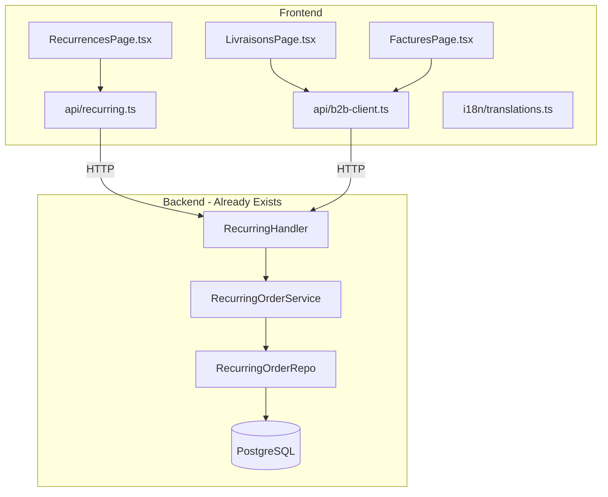

# Design Document: Comptoir Gaps (MA-69)

## Overview

This design addresses four issues in the B2B Comptoir portal:

1. **Recurrences Page**: Replace the placeholder shell with a real CRUD UI wired to the existing `GET/POST/PUT/DELETE /api/recurring-orders` endpoints and `frontend/src/api/recurring.ts` client.
2. **Dead Editer Button**: Wire the `onClick` handler on LivraisonsPage to call `editOrder` from `b2b-client.ts`.
3. **Swallowed Errors**: Replace `catch { set([]) }` patterns with proper error state management in FacturesPage and LivraisonsPage.
4. **French Accents**: Fix accent-stripped strings in the FR section of `translations.ts` and replace hardcoded English `"{n} items"` with an i18n key.

The backend API for recurring orders already exists (`internal/api/recurring_handler.go`) with full CRUD. The frontend API client exists (`frontend/src/api/recurring.ts`) with `fetchRecurringOrders`, `pauseRecurringOrder`, `resumeRecurringOrder`, and `deleteRecurringOrder`. The gap is purely in the page component and a missing `createRecurringOrder` client function.

**Scheduler worker**: The ticket mentions that nothing materializes recurring orders into real orders. This design explicitly scopes OUT the scheduler worker — it belongs to a separate ticket. The Recurrences page manages templates; a future cron/worker will create actual orders from them.

## Architecture



All changes are frontend-only except for adding `createRecurringOrder` to `api/recurring.ts` (the backend endpoint already exists).

## Components and Interfaces

### 1. RecurrencesPage Rewrite

**Current state**: Local `useState<RecurrenceTemplate[]>([])` with no API call; form only shows a label.

**Target state**: Full CRUD page using the existing `recurring.ts` API client.

```typescript
// New state shape
interface RecurrencesPageState {
  orders: RecurringOrder[];
  page: number;
  total: number;
  loading: boolean;
  error: string | null;        // new: error state
  showForm: boolean;
  editingOrder: RecurringOrder | null;  // new: edit mode
}
```

**Form fields** (matching `CreateRecurringOrderRequest` DTO):
- `bakeryId` — dropdown from `listApprovedBakeries()`
- `items` — product picker (reuse existing product selection from CommanderPage)
- `frequency` — `"weekly"` | `"biweekly"`
- `scheduledDay` — day of week dropdown
- `scheduledTime` — start/end time inputs
- `selectionMode` — `"fixed"` | `"bakeryChoice"` | `"randomFavorites"`

**API client addition** (`api/recurring.ts`):
```typescript
export interface CreateRecurringOrderPayload {
  bakeryId: string;
  items: { productId: string; quantity: number }[];
  scheduledDay: string;
  scheduledTime: { startTime: string; endTime: string };
  frequency: string;
  selectionMode: string;
}

export function createRecurringOrder(data: CreateRecurringOrderPayload): Promise<RecurringOrder> {
  return apiFetch<RecurringOrder>('/recurring-orders', {
    method: 'POST',
    body: JSON.stringify(data),
  });
}
```

### 2. LivraisonsPage Edit Button

**Current** (line ~116):
```tsx
<button type="button" className="livraisons-page__edit-btn">
  {t('comptoir.deliveries.edit')}
</button>
```

**Target**: Add `onClick` that navigates to an edit modal or inline edit. Given `editOrder` in `b2b-client.ts` accepts `(orderId, items[])`, the simplest approach is to navigate to a route like `/comptoir/commander?edit={orderId}` or open an inline editor. Design choice: **inline modal** reusing the product picker pattern from CommanderPage, since the edit flow is lightweight (modify quantities, save).

### 3. Error State Pattern

**Shared component**: Create a reusable `ErrorState` component:

```typescript
interface ErrorStateProps {
  message: string;
  onRetry: () => void;
}
```

**Integration pattern** for FacturesPage and LivraisonsPage:
```typescript
const [error, setError] = useState<string | null>(null);

// In fetch:
catch (err) {
  setError(t('comptoir.common.loadError'));
  // Do NOT reset data to []
}

// In render:
{error && !loading && <ErrorState message={error} onRetry={fetchData} />}
```

For PDF download, show an inline toast/notification rather than silently failing.

### 4. i18n Fixes

**Broken FR strings** in `translations.ts` (lines ~700-714):

| Current (accent-stripped) | Corrected |
|--------------------------|-----------|
| `'A venir'` | `'À venir'` |
| `'Passees'` | `'Passées'` |
| `'Editer'` | `'Éditer'` |
| `'Confirmee'` | `'Confirmée'` |
| `'Prete'` | `'Prête'` |
| `'Livree'` | `'Livrée'` |
| `'recurrentes'` | `'récurrentes'` |
| `'recurrence'` | `'récurrence'` |
| `'Frequence'` | `'Fréquence'` |
| `'Desactiver'` | `'Désactiver'` |
| `'depassee'` | `'dépassée'` |
| `'Creneau'` | `'Créneau'` |
| `'sauvegardees'` | `'sauvegardées'` |
| `'derniere'` | `'dernière'` |
| `'Payee'` | `'Payée'` |

**Hardcoded English**: `{d.items.length} items` in LivraisonsPage becomes:
```tsx
{t('comptoir.deliveries.itemCount', { n: d.items.length })}
```

New i18n key (all 3 locales):
- EN: `"{n} items"` / `"{n} item"` (singular)
- FR: `"{n} articles"` / `"{n} article"`
- NL: `"{n} artikelen"` / `"{n} artikel"`

Since the existing i18n system uses simple string interpolation (no ICU), we use a single key with `{n}` placeholder and always use plural form (item counts are typically > 1 in B2B context; singular edge-case handled by the label itself).

## Data Models

No new data models required. The existing `RecurringOrder` type in `frontend/src/api/recurring.ts` already maps to the backend DTO. The only addition is the `CreateRecurringOrderPayload` interface for the POST body.

## Error Handling

| Scenario | Current Behavior | Target Behavior |
|----------|-----------------|-----------------|
| `listInvoices` network error | `catch { setInvoices([]) }` — shows "Aucune facture" | `setError(msg)` — shows ErrorState with retry |
| `listDeliveries` network error | `catch { setDeliveries([]) }` — shows "Aucune livraison" | `setError(msg)` — shows ErrorState with retry |
| `downloadInvoicePDF` failure | `// Silently fail` | Show toast notification with error message |
| `editOrder` failure | N/A (button is dead) | Show inline error message on the edit modal |
| Recurring order CRUD failures | Page never called API | Show ErrorState or inline form validation errors |

## Testing Strategy

This is primarily a UI wiring and i18n fix ticket. Property-based testing is **not applicable** because:
- The changes are UI component wiring (connecting existing API clients to existing pages)
- i18n string corrections are deterministic lookups
- Error state rendering is a simple conditional branch

**Appropriate testing approach**:
- **Unit tests** (Vitest + React Testing Library): Test that RecurrencesPage renders data from mocked API, test error states render correctly, test edit button fires the correct handler.
- **i18n tests**: Verify FR translations contain expected accented characters and no hardcoded English in comptoir pages.
- **Integration tests**: Manual verification via the existing e2e framework that the full flow works.
