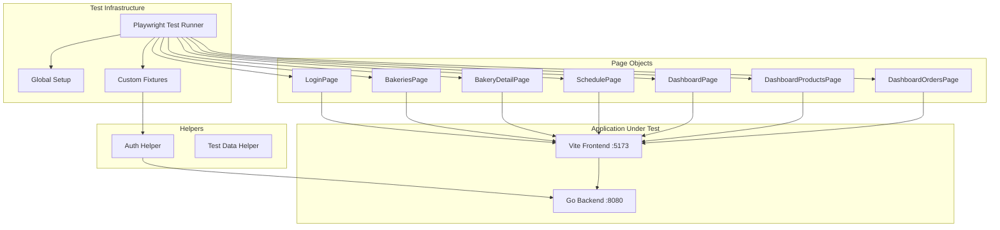
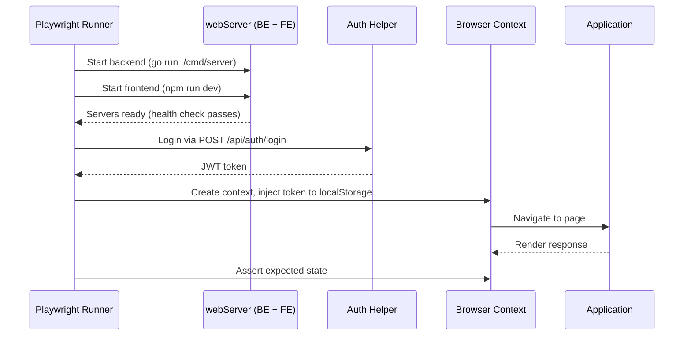

# Design Document: E2E Playwright Tests

## Overview

This design covers a Playwright-based end-to-end test suite for the Mie et Beurre bakery application. The tests run against the full stack — the Go backend (port 8080) and Vite React frontend (port 5173) together — validating real user flows from login through ordering, baker management, and beyond.

The test suite lives at the project root level (`e2e/`) since it exercises both backend and frontend as an integrated system. It uses TypeScript, the Page Object Model pattern, and custom Playwright fixtures for authenticated user contexts.

### Key Design Decisions

1. **Root-level test directory** — `e2e/` at the project root rather than inside `frontend/` because tests exercise the full stack.
2. **Playwright `webServer` config** — auto-starts both backend (`go run ./cmd/server`) and frontend (`npm run dev`) before tests, ensuring a clean environment.
3. **API-based authentication** — login via `POST /api/auth/login` and inject the JWT token into `localStorage` using `page.evaluate()`. No UI-based login in setup — faster and more reliable.
4. **Custom fixtures** — provide pre-authenticated `customerPage`, `bakerPage`, and `adminPage` contexts so tests don't repeat login boilerplate.
5. **One spec file per requirement area** — clear mapping between requirements and test files.
6. **Page Object Model** — encapsulates selectors and interactions for maintainability.

## Architecture



### Test Execution Flow



## Components and Interfaces

### Directory Structure

```
e2e/
├── playwright.config.ts          # Playwright configuration
├── package.json                  # Dependencies (@playwright/test)
├── tsconfig.json                 # TypeScript config
├── fixtures/
│   └── auth.fixture.ts           # Custom fixtures for authenticated contexts
├── helpers/
│   ├── auth.ts                   # API login helper, token injection
│   └── test-data.ts              # Constants for seeded test data
├── page-objects/
│   ├── LoginPage.ts
│   ├── BakeriesPage.ts
│   ├── BakeryDetailPage.ts
│   ├── SchedulePage.ts
│   ├── DashboardPage.ts
│   ├── DashboardProductsPage.ts
│   └── DashboardOrdersPage.ts
└── tests/
    ├── auth.spec.ts              # Req 8, 9, 10
    ├── customer-order.spec.ts    # Req 2
    ├── customer-reservation.spec.ts  # Req 3
    ├── customer-management.spec.ts   # Req 4
    ├── guest-access.spec.ts      # Req 5
    ├── baker-dashboard.spec.ts   # Req 6
    ├── baker-orders.spec.ts      # Req 7
    ├── responsive.spec.ts        # Req 11
    ├── allergens.spec.ts         # Req 12
    └── i18n.spec.ts              # Req 13
```

### Playwright Configuration

```typescript
// playwright.config.ts
import { defineConfig } from '@playwright/test';

export default defineConfig({
  testDir: './tests',
  timeout: 30_000,
  retries: 1,
  use: {
    baseURL: 'http://localhost:5173',
    trace: 'on-first-retry',
    screenshot: 'only-on-failure',
  },
  projects: [
    { name: 'chromium', use: { browserName: 'chromium' } },
  ],
  webServer: [
    {
      command: 'go run ./cmd/server',
      cwd: '..',           // project root (e2e/ is one level down)
      port: 8080,
      reuseExistingServer: !process.env.CI,
      timeout: 30_000,
    },
    {
      command: 'npm run dev',
      cwd: '../frontend',
      port: 5173,
      reuseExistingServer: !process.env.CI,
      timeout: 15_000,
    },
  ],
});
```

### Auth Helper Interface

```typescript
// helpers/auth.ts
import { Page, BrowserContext } from '@playwright/test';

interface LoginCredentials {
  username: string;
  password: string;
}

interface AuthToken {
  token: string;
}

/**
 * Logs in via the backend API and injects the JWT token into localStorage.
 * Avoids slow UI-based login for test setup.
 */
export async function loginAsUser(
  page: Page,
  credentials: LoginCredentials
): Promise<void>;

/**
 * Creates a new browser context with auth token already set.
 * Used by fixtures to provide pre-authenticated pages.
 */
export async function createAuthenticatedContext(
  browser: Browser,
  credentials: LoginCredentials,
  baseURL: string
): Promise<BrowserContext>;
```

### Custom Fixtures Interface

```typescript
// fixtures/auth.fixture.ts
import { test as base } from '@playwright/test';

type AuthFixtures = {
  customerPage: Page;  // Pre-authenticated as alice/customer123
  bakerPage: Page;     // Pre-authenticated as baker_jean/baker123
  adminPage: Page;     // Pre-authenticated as admin/admin123
};

export const test = base.extend<AuthFixtures>({
  customerPage: async ({ browser }, use) => { /* ... */ },
  bakerPage: async ({ browser }, use) => { /* ... */ },
  adminPage: async ({ browser }, use) => { /* ... */ },
});
```

### Page Object Interface (Example: BakeriesPage)

```typescript
// page-objects/BakeriesPage.ts
import { Page, Locator } from '@playwright/test';

export class BakeriesPage {
  readonly page: Page;
  readonly bakeryCards: Locator;
  readonly searchInput: Locator;

  constructor(page: Page) { /* ... */ }

  async goto(): Promise<void>;
  async getBakeryCount(): Promise<number>;
  async clickBakery(name: string): Promise<void>;
}
```

## Data Models

### Test Data Constants

The test suite relies on seeded data that is loaded fresh on each backend startup (in-memory repositories). Key constants:

```typescript
// helpers/test-data.ts
export const USERS = {
  admin:    { username: 'admin', password: 'admin123', role: 'admin' },
  baker:    { username: 'baker_jean', password: 'baker123', role: 'seller' },
  baker2:   { username: 'baker_marie', password: 'baker123', role: 'seller' },
  customer: { username: 'alice', password: 'customer123', role: 'customer' },
  customer2:{ username: 'bob', password: 'customer123', role: 'customer' },
} as const;

export const BAKERIES = {
  bakery1: { id: 'bakery-1', name: 'La Boulangerie du Coin' },
  bakery2: { id: 'bakery-2', name: 'Mie & Beurre' },
  bakery3: { id: 'bakery-3', name: 'Le Fournil de Max' },
} as const;

export const REGISTRATION_CODE = 'DEMO1234';

export const SEEDED_COUNTS = {
  bakeries: 3,
  products: 15,
  orders: 3,
  reservations: 2,
  recurringOrders: 2,
} as const;
```

### Auth Token Shape

The JWT token payload returned by `POST /api/auth/login`:

```typescript
interface JWTPayload {
  sub: string;     // user ID (e.g., "customer-1")
  username: string;
  role: number;    // 0=admin, 1=seller, 2=customer
  exp: number;     // expiration timestamp
  iat: number;     // issued at timestamp
}
```

Token is stored in `localStorage` under the key `auth_token`.

## Error Handling

### Test Reliability

| Scenario | Strategy |
|----------|----------|
| Server not ready | Playwright `webServer` config with port check + timeout |
| Flaky network | `retries: 1` in config; explicit `waitForResponse` on API calls |
| Slow renders | Use `page.waitForSelector()` and Playwright auto-waiting |
| Stale data between tests | Backend uses in-memory repos, restarted per test run via webServer |
| CI environment differences | `reuseExistingServer: !process.env.CI` — always fresh in CI |

### Test Isolation

- Each test file gets its own browser context via fixtures.
- Tests that mutate data (create order, delete product) use separate fixture contexts so they don't interfere with read-only tests.
- The backend restarts on each full test run, resetting seeded data to a known state.

### Common Failure Patterns

- **Auth token expired during test**: Token validity should far exceed test timeout. If it occurs, the `auth:unauthorized` event fires and the test will detect an unexpected redirect.
- **Modal not appearing**: Use `page.waitForSelector` with a reasonable timeout and clear error message via custom expect matchers.
- **Race condition on order creation**: Wait for the confirmation response (`waitForResponse`) before asserting UI state.

## Testing Strategy

### Approach

This feature is the E2E test suite itself. The "testing strategy" here describes how the tests are structured rather than how the test code is tested.

**Property-based testing does not apply to this feature.** E2E tests verify specific user interaction scenarios against a running application. They are inherently example-based — each test exercises a concrete flow (login → navigate → click → assert). The test inputs are deterministic seeded data, not randomly generated. Running 100+ iterations of a browser-based flow is neither practical nor meaningful.

### Test Categories

| Category | Test File | Requirements Covered |
|----------|-----------|---------------------|
| Authentication & Registration | `auth.spec.ts` | Req 8, 9, 10 |
| Customer Order Flow | `customer-order.spec.ts` | Req 2 |
| Customer Reservation Flow | `customer-reservation.spec.ts` | Req 3 |
| Customer Order Management | `customer-management.spec.ts` | Req 4 |
| Guest Access | `guest-access.spec.ts` | Req 5 |
| Baker Dashboard | `baker-dashboard.spec.ts` | Req 6 |
| Baker Order Processing | `baker-orders.spec.ts` | Req 7 |
| Responsive Layout | `responsive.spec.ts` | Req 11 |
| Allergen Indicators | `allergens.spec.ts` | Req 12 |
| Internationalization | `i18n.spec.ts` | Req 13 |

### Running Tests

```bash
# From the e2e/ directory:
npx playwright test                    # Run all tests
npx playwright test auth.spec.ts       # Run single file
npx playwright test --headed           # Visual debugging
npx playwright show-report             # View HTML report after run
```

### CI Integration

- Tests run in headless Chromium only (single project for speed).
- `webServer` config ensures both servers start automatically.
- On failure: screenshots + traces are captured for debugging.
- Retries set to 1 to handle occasional timing flakiness.

### Test Writing Conventions

1. Each test should be independent — no reliance on execution order.
2. Use page objects for all element interactions — no raw selectors in spec files.
3. Use custom fixtures (`customerPage`, `bakerPage`) instead of repeating login logic.
4. Prefer `getByRole`, `getByText`, `getByTestId` over CSS selectors for resilience.
5. Every assertion should have a clear error message via Playwright's built-in messaging.
6. Tests that create data should verify creation via UI, not direct API calls (true E2E).
