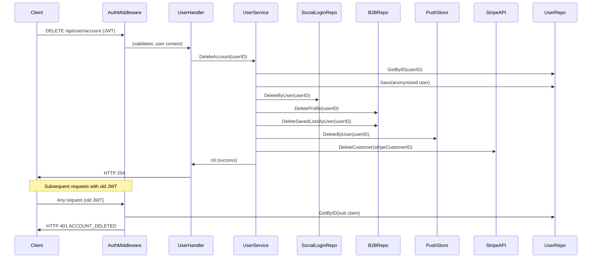

# Design: GDPR Completeness — Deletion, Export, and Token Invalidation

## Overview

This design extends the existing `DeleteAccount` flow to achieve full GDPR Article 17 compliance by removing all personally identifiable data across auxiliary tables and external services, adds a middleware-level check to reject JWTs for deleted users, and fills the gap in the data export (missing reviews).

The approach favours minimal changes: the existing anonymize-then-keep strategy for the `users` row is preserved (bakery order history references remain intact), and new cleanup steps are appended to the existing `DeleteAccount` method.

## Architecture

The deletion flow follows the existing service-layer pattern. `UserService.DeleteAccount` orchestrates all cleanup steps, delegating to the relevant repositories and external clients:



## Components and Interfaces

### Modified: `UserService.DeleteAccount`

New cleanup steps appended after the existing anonymization:

1. Delete social logins via `SocialLoginRepo.DeleteByUser(ctx, userID)`
2. Delete B2B profile via `B2BRepo.DeleteProfile(ctx, userID)`
3. Delete saved lists via `B2BRepo.DeleteSavedListsByUser(ctx, userID)`
4. Clear push subscriptions via `PushStore.DeleteByUser(userID)`
5. Delete Stripe Customer via `StripeCustomerService.DeleteCustomer(ctx, stripeCustomerID)` (best-effort, log on failure)

### Modified: `UserService.ExportData`

Add a `ReviewRepository.ListByUser(ctx, userID)` call to populate the `Reviews` field in the export response.

### New: `SocialLoginRepository.DeleteByUser`

```go
// DeleteByUser removes all social login records for the given user.
DeleteByUser(ctx context.Context, userID string) error
```

### New: `B2BRepository.DeleteProfile`

```go
// DeleteProfile hard-deletes the business_profiles row for the given user.
DeleteProfile(ctx context.Context, userID string) error
```

### New: `B2BRepository.DeleteSavedListsByUser`

```go
// DeleteSavedListsByUser removes all saved_lists (and their items via CASCADE) for a user.
DeleteSavedListsByUser(ctx context.Context, userID string) error
```

### New: `push.Store.DeleteByUser`

```go
// DeleteByUser removes all push subscriptions for a given user ID.
func (s *Store) DeleteByUser(userID string)
```

### New: `ReviewRepository.ListByUser`

```go
// ListByUser returns all reviews authored by a user (regardless of hidden status).
ListByUser(ctx context.Context, userID string) ([]Review, error)
```

### New: `StripeCustomerService.DeleteCustomer`

```go
// DeleteCustomer deletes the Stripe Customer object. Returns nil if customerID is empty.
func (s *StripeCustomerService) DeleteCustomer(ctx context.Context, customerID string) error
```

### Modified: `JWTAuth` Middleware

The middleware gains a `UserRepository` dependency. After token validation, it checks whether the user is deleted (username starts with `deleted-` and contact_email is empty). If so, it returns 401 with `ACCOUNT_DELETED`.

To keep the middleware efficient, we use a lightweight check: the middleware calls `UserRepo.GetByID` which is already cached/fast in the existing Postgres connection pool. For high-traffic scenarios, a short TTL cache or a `deleted_at` timestamp column could be added later, but the simple approach suffices for current scale.

### New middleware signature:

```go
func JWTAuth(secret string, userRepo domain.UserRepository) func(http.Handler) http.Handler
```

## Data Models

### Existing models — no structural changes

The `User`, `SocialLogin`, `BusinessProfile`, `Review` structs remain unchanged. The deletion logic uses existing fields:

- **Deleted user detection**: `user.Username` starts with `"deleted-"` AND `user.ContactEmail == ""`
- **Stripe cleanup**: uses existing `user.StripeCustomerID` before clearing it

### Export DTO addition

The `DataExportReview` struct already exists in `internal/api/dto/responses.go` with fields `ID`, `BakeryID`, `Rating`, `Text`, `CreatedAt`. No new DTO needed.

## Correctness Properties

*A property is a characteristic or behavior that should hold true across all valid executions of a system — essentially, a formal statement about what the system should do. Properties serve as the bridge between human-readable specifications and machine-verifiable correctness guarantees.*

### Property 1: Complete PII erasure across all tables

*For any* user with any combination of social logins, B2B profile, saved lists, and push subscriptions, after `DeleteAccount` completes successfully, querying `social_logins`, `business_profiles`, `saved_lists`, and the push store for that user ID SHALL return zero records.

**Validates: Requirements 1.1, 1.2, 2.1, 2.2, 2.3, 3.1, 3.2**

### Property 2: Stripe Customer deletion is attempted for all users with a customer ID

*For any* user with a non-empty `stripe_customer_id`, `DeleteAccount` SHALL invoke the Stripe Customer delete API with that customer ID (verified via mock).

**Validates: Requirements 4.1, 4.3**

### Property 3: Deleted-user JWT rejection

*For any* valid JWT whose `sub` claim references a Deleted_User, the Auth_Middleware SHALL reject the request with HTTP 401 and code `ACCOUNT_DELETED`.

**Validates: Requirements 5.1, 5.2**

### Property 4: Active-user JWT passthrough

*For any* valid JWT whose `sub` claim references an active (non-deleted) user, the Auth_Middleware SHALL allow the request to proceed (no 401 returned).

**Validates: Requirements 5.3**

### Property 5: Export includes all user reviews

*For any* user with N reviews (where N >= 0), the data export `reviews` array SHALL contain exactly N entries, each with a non-empty ID, bakery ID, rating, and creation timestamp.

**Validates: Requirements 6.1, 6.2, 6.3**

## Error Handling

| Scenario | Behavior |
|----------|----------|
| Stripe API fails during customer deletion | Log error, continue with remaining cleanup steps. `DeleteAccount` returns nil (success). Rationale: user should not be blocked from exercising erasure rights due to a transient Stripe failure. |
| Social login repo fails | Return error from `DeleteAccount`. Deletion is incomplete; user can retry. |
| B2B repo fails | Return error from `DeleteAccount`. Deletion is incomplete; user can retry. |
| Push store deletion | In-memory operation, cannot fail (no error return). |
| User not found during middleware check | Allow request (user may have been created after the check logic was added, or repo is temporarily unavailable). This avoids blocking legitimate users on transient DB issues. |
| ReviewRepo.ListByUser fails during export | Log error, return empty reviews array (graceful degradation, matching existing pattern for other repos). |

## Testing Strategy

### Unit Tests (example-based)

- **Stripe failure resilience**: Mock Stripe to return error, verify `DeleteAccount` still succeeds and other cleanup runs.
- **Middleware deleted-user check**: Create a deleted user, issue a JWT, assert 401 response with correct code.
- **Middleware active-user passthrough**: Create an active user, issue a JWT, assert request proceeds.
- **Export with zero reviews**: Verify empty array (not null) in export response.
- **Documentation content**: Assert `DATA-INVENTORY.md` contains expected retention descriptions.

### Property-Based Tests

Library: **rapid** (Go property-based testing library, `pgregory.net/rapid`)

Configuration: Minimum 100 iterations per property test.

Each property test references its design document property:

- **Feature: gdpr-completeness, Property 1**: Generate random user state (0-5 social logins, optional B2B profile, 0-3 saved lists, 0-4 push subs), invoke DeleteAccount, verify zero residual records.
- **Feature: gdpr-completeness, Property 2**: Generate random user with/without stripe_customer_id, invoke DeleteAccount with mock Stripe, verify delete called iff customer ID was non-empty.
- **Feature: gdpr-completeness, Property 3**: Generate random deleted usernames/emails, create JWT, run through middleware, verify rejection.
- **Feature: gdpr-completeness, Property 4**: Generate random active usernames, create JWT, run through middleware, verify passthrough.
- **Feature: gdpr-completeness, Property 5**: Generate random user with 0-10 reviews, invoke ExportData, verify reviews array length and field completeness.
