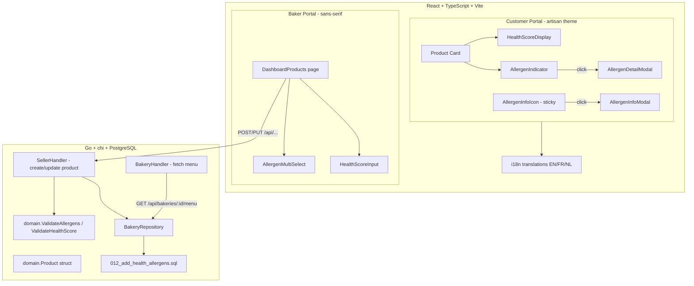
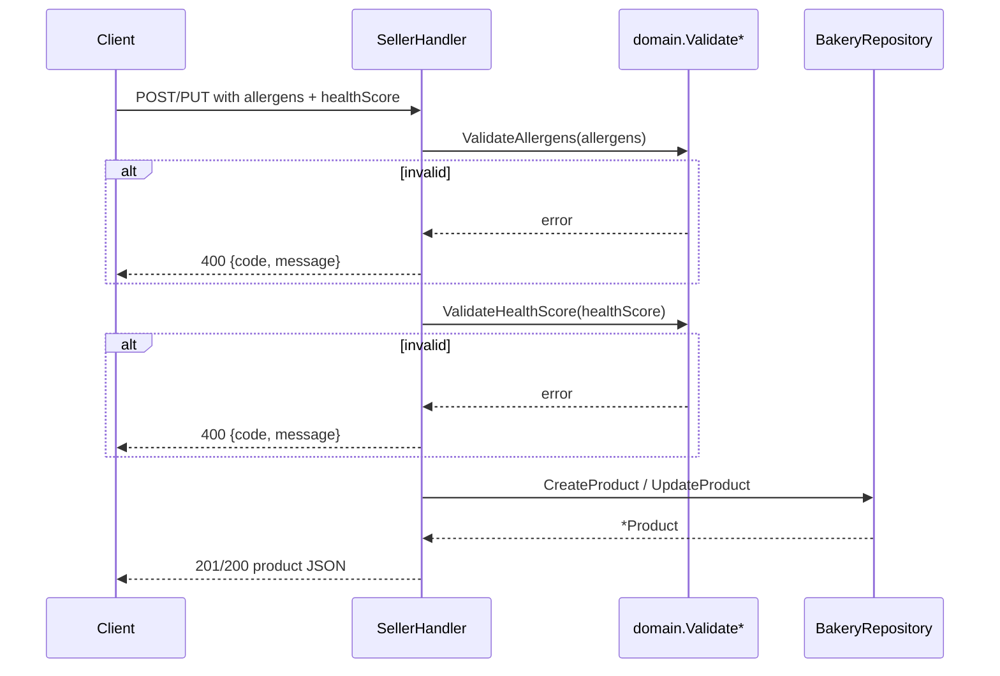

# Design Document: Health & Allergen Indicators

## Overview

This feature adds two pieces of dietary information to bakery products:

1. **Health Score** — a numeric rating (1–5) assigned by bakers, displayed as a number on product cards.
2. **Allergen Indicators** — per-product allergen icons on cards (with hover tooltip + click detail modal) plus a page-level floating allergen education icon.

The implementation touches all layers: database migration, Go domain/validation/API, and React frontend components in both the baker portal and customer portal.

### Key Design Decisions

| Decision | Rationale |
|----------|-----------|
| `health_score INTEGER NULL` (not TEXT[] badges) | Simple numeric value; 1–5 scale is compact and language-neutral |
| `allergens TEXT[] DEFAULT '{}'` (PostgreSQL array) | Leverages native array type for set semantics; avoids join table for a bounded set of 14 |
| Single migration `012_add_health_allergens.sql` | Follows existing goose-based numbered migration sequence |
| Page-level `AllergenInfoIcon` as sticky footer button | Always accessible regardless of scroll position; not tied to any product |
| Predefined allergen constants in Go `domain` package | Single source of truth; validated at API boundary |

## Architecture



## Components and Interfaces

### Backend (Go)

#### Domain Layer

```go
// internal/domain/allergens.go

// Allergen represents a valid EU-regulated allergen identifier.
type Allergen string

const (
    AllergenGluten      Allergen = "gluten"
    AllergenCrustaceans Allergen = "crustaceans"
    AllergenEggs        Allergen = "eggs"
    AllergenFish        Allergen = "fish"
    AllergenPeanuts     Allergen = "peanuts"
    AllergenSoy         Allergen = "soy"
    AllergenDairy       Allergen = "dairy"
    AllergenNuts        Allergen = "nuts"
    AllergenCelery      Allergen = "celery"
    AllergenMustard     Allergen = "mustard"
    AllergenSesame      Allergen = "sesame"
    AllergenSulphites   Allergen = "sulphites"
    AllergenLupin       Allergen = "lupin"
    AllergenMolluscs    Allergen = "molluscs"
)

// ValidAllergens is the complete set of valid allergen identifiers.
var ValidAllergens = map[Allergen]bool{ /* all 14 */ }

// ValidateAllergens checks that all provided values are in the valid set,
// are unique, and the array has at most maxAllergens (20) elements.
// Returns an error describing the first invalid value found.
func ValidateAllergens(allergens []string) error { ... }

// ValidateHealthScore checks that score is nil or in [1, 5].
func ValidateHealthScore(score *int) error { ... }
```

#### Updated Product Model

```go
// internal/domain/models.go (updated Product struct)

type Product struct {
    ID          string    `json:"id"`
    BakeryID    string    `json:"bakeryId"`
    Name        string    `json:"name"`
    Description string    `json:"description"`
    Price       int64     `json:"price"`
    PhotoURL    string    `json:"photoUrl"`
    Category    string    `json:"category"`
    IsAvailable bool      `json:"isAvailable"`
    Allergens   []string  `json:"allergens"`    // subset of ValidAllergens; empty = no allergens
    HealthScore *int      `json:"healthScore"`  // nullable; 1-5
}
```

#### API Handler Changes

The `SellerHandler.CreateProduct` and `SellerHandler.UpdateProduct` methods are extended:

```go
// CreateProduct request body adds:
type CreateProductRequest struct {
    Name        string   `json:"name"`
    Description string   `json:"description"`
    Price       int64    `json:"price"`
    PhotoURL    string   `json:"photoUrl"`
    Category    string   `json:"category"`
    Allergens   []string `json:"allergens"`    // optional, defaults to []
    HealthScore *int     `json:"healthScore"`  // optional, defaults to nil
}

// UpdateProduct: the existing map[string]interface{} approach already supports
// partial updates. The handler will check for "allergens" and "healthScore" keys
// and validate before applying.
```

#### Validation Flow



### Frontend — Baker Portal

#### `AllergenMultiSelect` Component

A checkbox group listing all 14 allergens. Used inside the product form modal in `DashboardProducts`.

```typescript
interface AllergenMultiSelectProps {
  selected: string[];
  onChange: (allergens: string[]) => void;
}
```

- Renders 14 checkboxes (grouped in 2 columns for readability)
- Uses system sans-serif (dashboard theme)
- No i18n needed — baker portal is admin-facing, uses English allergen keys

#### `HealthScoreInput` Component

A number input with min=1, max=5, step=1, that also allows clearing (setting to null).

```typescript
interface HealthScoreInputProps {
  value: number | null;
  onChange: (score: number | null) => void;
  error?: string;
}
```

- Shows label: "Health score (1 = least healthy, 5 = healthiest)"
- Client-side validation: rejects values outside 1–5 before form submit
- Clear button or empty input → null

### Frontend — Customer Portal

#### `HealthScoreDisplay` Component

Displays the numeric health score on a product card.

```typescript
interface HealthScoreDisplayProps {
  score: number; // 1-5 (only rendered when non-null)
}
```

- Renders as a small badge: e.g., `🌿 3/5` or a simple numeric chip
- `aria-label="Health score: {score} out of 5"`
- Positioned within the product card info area (visible without hover/expand)
- Uses artisan theme colors (warm palette, Caveat/Patrick Hand vibe for label)

#### `AllergenIndicator` Component

A small icon on the product card that communicates allergen presence.

```typescript
interface AllergenIndicatorProps {
  allergens: string[];   // non-empty (component is not rendered when empty)
  productName: string;
  locale: Locale;
}
```

- 24×24px desktop, 20×20px < 768px
- Positioned at bottom-right of product card, overlapping edge
- Hover/focus: shows tooltip with comma-separated translated allergen names
- Click: opens `AllergenDetailModal`; stops event propagation
- `aria-label="Contains allergens"`

#### `AllergenDetailModal` Component

Per-product modal showing the full allergen breakdown.

```typescript
interface AllergenDetailModalProps {
  isOpen: boolean;
  onClose: () => void;
  productName: string;
  allergens: string[];
  locale: Locale;
}
```

- Title: product name
- Body: alphabetically sorted (in active language) list of translated allergen names
- Focus trap + Escape/outside-click to close
- Renders above ProductSelectionModal via z-index layering

#### `AllergenInfoIcon` Component (Page-Level Floating Button)

A floating sticky button at the bottom of the viewport providing general allergen education.

```typescript
interface AllergenInfoIconProps {
  locale: Locale;
}
```

- Fixed position: `bottom: 16px; right: 16px` (or left, avoiding overlap with order CTA)
- 40×40px desktop, 36×36px mobile
- `aria-label="Allergen information"`
- Click: opens `AllergenInfoModal`
- Visible on BakeryDetailPage and while ProductSelectionModal is open

#### `AllergenInfoModal` Component (General Education)

A modal with general EU allergen information — not product-specific.

```typescript
interface AllergenInfoModalProps {
  isOpen: boolean;
  onClose: () => void;
  locale: Locale;
}
```

- Title: "Allergen Information" (translated)
- Intro paragraph explaining allergens and food safety
- Lists all 14 EU-regulated allergens with translated name + description
- Focus trap + Escape/outside-click to close
- Returns focus to `AllergenInfoIcon` on close

### Frontend — Updated TypeScript Types

```typescript
// types/bakery.ts — updated Product interface
export interface Product {
  id: string;
  bakeryId: string;
  name: string;
  description: string;
  price: number;         // cents
  photoUrl: string;
  category: string;
  isAvailable: boolean;
  allergens: string[];   // always present (empty array if none)
  healthScore: number | null;
}
```

## Data Models

### Database Migration: `012_add_health_allergens.sql`

```sql
-- +goose Up
ALTER TABLE products
  ADD COLUMN allergens TEXT[] NOT NULL DEFAULT '{}',
  ADD COLUMN health_score INTEGER NULL;

-- Constraint: health_score must be 1-5 when not null
ALTER TABLE products
  ADD CONSTRAINT chk_health_score
  CHECK (health_score IS NULL OR (health_score >= 1 AND health_score <= 5));

-- +goose Down
ALTER TABLE products DROP CONSTRAINT IF EXISTS chk_health_score;
ALTER TABLE products DROP COLUMN IF EXISTS health_score;
ALTER TABLE products DROP COLUMN IF EXISTS allergens;
```

### Domain Constants (Go)

The 14 valid allergens are defined as constants in `internal/domain/allergens.go`. Validation is performed at the handler level before persistence.

### i18n Translation Keys

```
allergen.gluten.name / allergen.gluten.description
allergen.crustaceans.name / allergen.crustaceans.description
... (×14 allergens × 3 languages = 84 translation entries for names+descriptions)
health.score.label
health.score.explanation
allergenInfo.title
allergenInfo.intro
```

## Correctness Properties

*A property is a characteristic or behavior that should hold true across all valid executions of a system — essentially, a formal statement about what the system should do. Properties serve as the bridge between human-readable specifications and machine-verifiable correctness guarantees.*

### Property 1: Allergen data round-trip

*For any* valid subset of the 14 EU-regulated allergens (including empty set), creating or updating a product with that allergen set and then fetching the product SHALL return the exact same set of allergens.

**Validates: Requirements 1.1, 1.3, 9.1, 9.3, 9.7, 9.9**

### Property 2: Health score data round-trip

*For any* valid health score value (integer 1–5 or null), creating or updating a product with that score and then fetching the product SHALL return the exact same score value.

**Validates: Requirements 1.2, 1.4, 9.2, 9.4, 9.8, 9.9**

### Property 3: Invalid allergens are rejected

*For any* string not in the predefined set of 14 EU-regulated allergens, attempting to create or update a product with that string in the allergens array SHALL result in a 400 error response and the product SHALL remain unchanged.

**Validates: Requirements 1.6, 9.10**

### Property 4: Invalid health scores are rejected

*For any* integer outside the range [1, 5] (including 0, negatives, and values > 5), attempting to create or update a product with that value as health_score SHALL result in a 400 error response and the product SHALL remain unchanged.

**Validates: Requirements 1.7, 9.11**

### Property 5: Partial update preserves omitted fields

*For any* product with existing allergens and health_score, when an update request omits the allergens field and/or the health_score field, the omitted fields SHALL retain their previous values after the update.

**Validates: Requirements 9.5, 9.6**

### Property 6: Allergen indicator visibility follows allergen presence

*For any* product, the AllergenIndicator component is rendered if and only if the product's allergens array is non-empty. When rendered, it SHALL include an accessible label "Contains allergens".

**Validates: Requirements 3.1, 3.2, 3.6**

### Property 7: Tooltip shows translated comma-separated allergen names

*For any* product with a non-empty allergen set and *for any* supported locale (EN, FR, NL), hovering or focusing the AllergenIndicator SHALL display a tooltip containing the product's allergen names translated to the active locale, separated by commas.

**Validates: Requirements 3.7, 4.1, 4.3, 4.5**

### Property 8: Allergen detail modal shows sorted translated allergens

*For any* product with allergens and *for any* supported locale, the AllergenDetailModal SHALL display the product name as title and list all of the product's allergens sorted alphabetically by their translated name in the active locale.

**Validates: Requirements 5.2, 5.3, 5.5**

### Property 9: Health score display matches product data

*For any* product with a non-null health_score, the HealthScoreDisplay SHALL render showing the score value, with an accessible label "Health score: {score} out of 5". For any product with null health_score, no HealthScoreDisplay element SHALL be rendered.

**Validates: Requirements 6.1, 6.2, 6.6**

### Property 10: Translation completeness for allergens

*For any* allergen in the set of 14 EU-regulated allergens and *for any* supported locale (EN, FR, NL), the i18n system SHALL contain a non-empty translation for both the allergen name and the allergen description (≤150 characters).

**Validates: Requirements 8.1, 8.2, 8.4**

### Property 11: Translation fallback chain

*For any* translation key and *for any* locale, if the translation is missing in the active locale the system SHALL fall back to the EN translation. If the EN translation is also missing, the system SHALL display the raw translation key identifier.

**Validates: Requirements 8.6**

### Property 12: Baker form accepts all valid allergen/score combinations

*For any* combination of 0–14 allergens selected from the valid set and *for any* health score value (null or 1–5), the baker product form SHALL accept the input without validation errors, and SHALL correctly pre-populate when editing a product with those values.

**Validates: Requirements 2.3, 2.8, 2.9**

## Error Handling

| Scenario | Layer | Behavior |
|----------|-------|----------|
| Invalid allergen value in API request | Backend handler | Return 400 `INVALID_ALLERGEN` with the invalid value in the message |
| Health score outside 1–5 | Backend handler | Return 400 `INVALID_HEALTH_SCORE` with valid range in message |
| Allergens array > 20 elements | Backend handler | Return 400 `ALLERGEN_LIMIT_EXCEEDED` |
| Health score outside 1–5 in baker form | Frontend (client-side) | Show inline validation error, prevent form submit |
| Backend save failure | Frontend baker portal | Show error toast, retain form state (no data loss) |
| Missing translation key | Frontend i18n | Fall back to EN → raw key identifier |
| AllergenDetailModal click propagation | Frontend | `event.stopPropagation()` prevents parent card interaction |
| Database constraint violation (health_score CHECK) | PostgreSQL | Shouldn't occur due to handler-level validation; if it does, surfaces as 500 |

## Testing Strategy

### Unit Tests (Example-based)

- Baker form renders allergen multi-select with all 14 options
- Baker form renders health score input with correct min/max
- AllergenInfoIcon renders as sticky footer button
- AllergenInfoModal opens/closes with focus management
- AllergenDetailModal event propagation is stopped
- Focus trap works in both modals
- Language switching updates content without reload

### Property-Based Tests

Property-based testing is appropriate for this feature because:
- Allergen validation involves set operations (subsets, membership) with a large combinatorial space
- Health score validation involves range checking across integers
- Round-trip properties (create → fetch) verify data integrity across layers
- Translation completeness can be verified exhaustively across all allergen × locale combinations

**Library:** [rapid](https://github.com/flyingmutant/rapid) (Go) for backend properties

**Configuration:**
- Minimum 100 iterations per property
- Each test tagged with: `Feature: health-allergen-indicators, Property {N}: {title}`

**Properties to implement:**
1. Allergen data round-trip (Property 1)
2. Health score data round-trip (Property 2)
3. Invalid allergens rejected (Property 3)
4. Invalid health scores rejected (Property 4)
5. Partial update preserves omitted fields (Property 5)
6. Translation completeness (Property 10)
7. Translation fallback chain (Property 11)
8. Baker form valid combinations (Property 12)

Frontend properties (6, 7, 8, 9) will be tested as example-based component tests since React Testing Library doesn't integrate well with PBT generators for DOM assertions, but the logic (allergen sorting, translation lookup) will have property tests in utility functions.

### Integration Tests

- Full API flow: create product with allergens + score → fetch menu → verify response shape
- Migration test: apply migration on seeded DB, verify defaults
- Baker portal E2E: fill form → save → reload → verify pre-population
