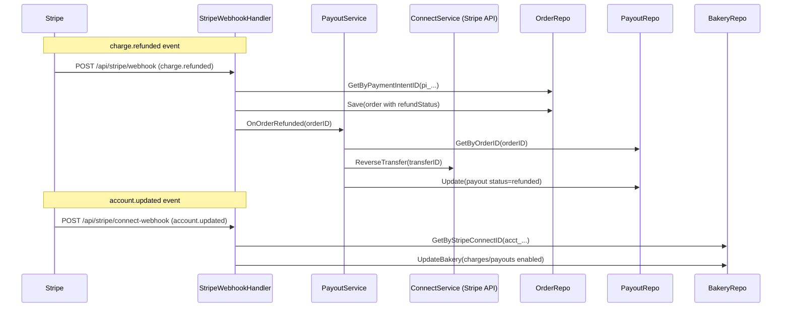

# Design: Refund-to-Payout Reversal and Onboarding Sync

## Overview

This design addresses three gaps in the payment pipeline:

1. **Transfer reversal on refund** — `PayoutService.OnOrderRefunded` exists but has zero callers. We wire it into both the order cancellation flow (when void fails and a refund is issued) and the `charge.refunded` webhook.
2. **Persisting refund status** — `updateRefundStatus` is implemented: it looks up the order by PaymentIntent ID and persists refund state idempotently. This design documents the existing correct implementation.
3. **Connect onboarding sync** — `account.updated` now persists `charges_enabled` and `payouts_enabled` on the bakery, removing the need for a live Stripe API call on every status check.

---

## Architecture



---

## Components and Interfaces

### 1. StripeWebhookHandler (existing — `internal/payment/stripe_webhook.go`)

**Current state**: Already handles `charge.refunded`, calls `updateRefundStatus`, and triggers `payoutReverser.OnOrderRefunded`. The implementation is complete and correct.

**Change needed**: None — the code already:
- Looks up the order by PaymentIntent ID
- Computes status ("refunded" vs "partial")
- Skips if order already has the target status (idempotent)
- Triggers `payoutReverser.OnOrderRefunded` for full refunds

The `SetPayoutReverser` method exists for dependency injection.

### 2. OrderService (existing — `internal/service/order_service.go`)

**Current state**: `DeleteOrder` already calls `s.onOrderRefunded(ctx, order.ID)` when a void fails and a refund is issued for a delivered order.

**Change needed**: None — the wiring is already in place. The `OnOrderRefunded` callback is injected via `OrderServiceConfig`.

### 3. PayoutService (existing — `internal/service/payout_service.go`)

**Current state**: `OnOrderRefunded` is fully implemented:
- Fetches payout by order ID
- Returns nil if no payout exists
- Marks non-transferred payouts as "refunded" directly
- Calls `ConnectService.ReverseTransfer` for transferred payouts
- Updates payout status to "refunded"

**Change needed**: None — logic is complete.

### 4. ConnectWebhookHandler (existing — `internal/payment/connect_webhook.go`)

**Current state**: `handleAccountUpdated` looks up the bakery by Connect ID and calls `UpdateBakery`. However, it does NOT persist `charges_enabled` / `payouts_enabled` because the `Bakery` struct lacks those fields.

**Changes needed**:
- Add `ChargesEnabled` and `PayoutsEnabled` boolean fields to the `Bakery` domain model
- Update `handleAccountUpdated` to set these fields from the Stripe account data before calling `UpdateBakery`
- Add idempotency check: skip the update if values already match

### 5. Main wiring (`cmd/server/main.go`)

**Current state**: Must ensure `PayoutService` is injected as the `PayoutReverser` on the webhook handler, and the `onOrderRefunded` callback is set on the order service.

**Change needed**: Verify wiring in `main.go` — if already done, no change needed.

---

## Data Models

### Migration: Add onboarding columns to bakeries

```sql
-- Migration: 025_add_bakery_onboarding_status.sql
-- +goose Up
ALTER TABLE bakeries ADD COLUMN charges_enabled BOOLEAN NOT NULL DEFAULT FALSE;
ALTER TABLE bakeries ADD COLUMN payouts_enabled BOOLEAN NOT NULL DEFAULT FALSE;

-- +goose Down
ALTER TABLE bakeries DROP COLUMN IF EXISTS payouts_enabled;
ALTER TABLE bakeries DROP COLUMN IF EXISTS charges_enabled;
```

### Domain Model Changes

**Bakery struct** (`internal/domain/models.go`) — add two fields:

```go
ChargesEnabled  bool   `json:"chargesEnabled"`   // synced from Stripe account.updated
PayoutsEnabled  bool   `json:"payoutsEnabled"`   // synced from Stripe account.updated
```

### Existing Models (unchanged)

- `Order.RefundStatus` — already has the `refund_status` column (migration 016)
- `Payout.Status` — already supports "refunded" (migration 022)
- `PayoutRepository.GetByOrderID` / `Update` — already exist

---

## Correctness Properties

*A property is a characteristic or behavior that should hold true across all valid executions of a system — essentially, a formal statement about what the system should do.*

### Property 1: Refund status idempotency

*For any* order with a given PaymentIntent ID, calling `updateRefundStatus` multiple times with the same refunded/total amounts SHALL produce identical persisted state — the final `RefundStatus` value is deterministic regardless of how many times the event is delivered.

**Validates: Requirements 2.2, 2.4**

### Property 2: Payout reversal correctness

*For any* order that has a payout with status "transferred" and a non-empty `StripeTransferID`, calling `OnOrderRefunded` SHALL result in the payout status being "refunded" and the transfer reversal API being called exactly once.

**Validates: Requirements 1.1**

### Property 3: No-op for missing payout

*For any* order ID that has no corresponding payout record, `OnOrderRefunded` SHALL return nil without calling any Stripe API.

**Validates: Requirements 1.2**

### Property 4: Onboarding sync idempotency

*For any* bakery whose stored `charges_enabled` and `payouts_enabled` already match the incoming webhook values, the `handleAccountUpdated` handler SHALL skip the database write.

**Validates: Requirements 3.4**

---

## Error Handling

| Scenario | Behavior |
|----------|----------|
| `charge.refunded` for unknown PaymentIntent | Log warning, return 200 |
| Transfer reversal fails (Stripe API error) | Log error, return error to caller; payout stays "transferred" for retry |
| `account.updated` for unknown Connect ID | Log, return 200 |
| Database write failure during refund status update | Log error, return 200 (Stripe will retry) |
| `OnOrderRefunded` called for already-refunded payout | No-op (payout status is already "refunded") |

---

## Testing Strategy

### Unit tests (existing, verify/extend)

- `TestUpdateRefundStatus_PersistsRefundedStatus` — already exists
- `TestUpdateRefundStatus_PersistsPartialStatus` — already exists
- `TestUpdateRefundStatus_IsIdempotent` — already exists
- `TestUpdateRefundStatus_TriggersPayoutReversal` — already exists
- `TestConnectWebhookHandler_AccountUpdated_SyncsBakeryStatus` — already exists, extend to verify `ChargesEnabled`/`PayoutsEnabled` fields

### New unit tests needed

- `TestConnectWebhookHandler_AccountUpdated_SetsOnboardingFlags` — verifies that `charges_enabled=true` from Stripe sets bakery field
- `TestConnectWebhookHandler_AccountUpdated_IdempotentSkipsUpdate` — no DB write if values already match
- `TestPayoutService_OnOrderRefunded_NonTransferredPayout` — marks pending payout as refunded without API call

### Integration test (manual/CI)

- Create order → deliver → trigger refund → verify transfer reversal created and payout marked "refunded"

---

## Security Considerations

- Webhook signature verification is already in place for both handlers (Stripe-Signature header)
- No secrets are logged; only account IDs and order IDs appear in log lines
- The `SetPayoutReverser` injection pattern avoids exposing internal service interfaces publicly
- Onboarding status fields are informational; they do not gate payment acceptance (Stripe enforces that independently)

