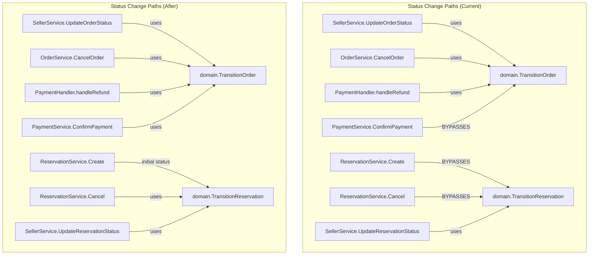

# Design Document: Stub & Dead-Code Cleanup (MA-68)

## Overview

This cleanup addresses five categories of technical debt:

1. **Apple SSO stub** -- The backend `AppleProvider.ExchangeCode` returns "not yet implemented". The frontend already gates the button behind `VITE_APPLE_OAUTH_ENABLED`, but the env var could be accidentally set. We remove the conditional entirely so the button never renders until the feature is complete.

2. **S3 upload** -- Already fixed. The server now fatals on unknown `UPLOAD_STORAGE` values. The old fake implementation has been replaced with an `ErrS3NotImplemented` sentinel. We confirm this is correct and add explicit handling for `"s3"` as a known-but-unimplemented value.

3. **State machine enforcement** -- `TransitionOrder`/`TransitionReservation` exist and are used by seller_service, order_service, and payment_handler. However, `payment/service.go` directly assigns `OrderStatusConfirmed` and `reservation_service.go` directly assigns both `ReservationStatusConfirmed` (creation) and `ReservationStatusCancelled` (cancellation). These must route through the state machine.

4. **Cookie consent** -- Already correctly implemented. `initSentry()` checks `getConsentValue() === 'all'` before initializing. No code change needed; we verify the implementation satisfies GDPR requirements.

5. **Dead weight** -- The compiled `server` binary (10 MB) is tracked in git. The `/dashboard/stats` route renders `DashboardSchedule` (misleading name). Other dead files (`BakeryListPage.tsx`, `DashboardReservations.tsx`, `DashboardBundlesPage.tsx`, `pkg/`, `recharts`) have already been removed in prior work.

## Architecture

No architectural changes. This is purely a cleanup pass that:
- Removes dead UI paths
- Ensures existing domain logic is used consistently
- Removes tracked artifacts

## Components and Interfaces

### 1. Apple SSO (Frontend)

**File:** `frontend/src/pages/LoginPage.tsx`

**Change:** Remove the `VITE_APPLE_OAUTH_ENABLED` conditional block and the Apple button entirely. Keep `AppleProvider` in backend and `AppleIcon` component for future use but unreferenced from routed pages.

### 2. Upload Storage Boot Validation

**File:** `cmd/server/main.go` (lines 96-109)

**Current state:** Already handles `""`, `"local"` and defaults with `log.Fatalf` for unknown values. We add an explicit `case "s3":` that fatals with a targeted message.

### 3. State Machine Enforcement

**Files:**
- `internal/payment/service.go` -- Replace direct `order.Status = domain.OrderStatusConfirmed` with `domain.TransitionOrder(order, domain.OrderStatusConfirmed)`
- `internal/service/reservation_service.go` -- Replace direct `reservation.Status = domain.ReservationStatusConfirmed` (creation) with proper initial-state logic, and replace direct `reservation.Status = domain.ReservationStatusCancelled` with `domain.TransitionReservation(reservation, domain.ReservationStatusCancelled)`

**Initial status for new reservations:** Since `TransitionReservation` requires an existing status to transition FROM, and new reservations don't have one yet, we introduce a `NewOrder`/`NewReservation` factory approach:
- Add `ReservationStatusPending` as a new initial pseudo-state, OR
- Set the initial status directly as the only allowed "creation assignment" with a clear comment

The pragmatic approach: Keep direct assignment for **initial creation only** (the entity doesn't exist yet, so there's no "from" state to transition from). Add a code comment marking this as the sole exception. All subsequent changes must use the state machine.

### 4. Cookie Consent

**Status:** Already correctly implemented. No changes needed. The `initSentry()` function checks consent before initializing, and is only called on load (if consent exists) or when user clicks "Accept All".

### 5. Dead Weight Removal

**Changes:**
- Add `/server` to `.gitignore`
- Run `git rm --cached server` to untrack the binary
- Rename route `/dashboard/stats` to `/dashboard/schedule` in `App.tsx`
- Update sidebar link in `DashboardLayout.tsx` from `to: '/dashboard/stats'` to `to: '/dashboard/schedule'`  and label from "Statistiques" to "Planning"
- Verify no `BakeryListPage.tsx`, `DashboardReservations.tsx`, `DashboardBundlesPage.tsx`, `pkg/`, or `recharts` exist (already cleaned)

## Data Models

No data model changes. The `Order` and `Reservation` domain structs remain unchanged. Status fields keep their existing types.

## Correctness Properties

*A property is a characteristic or behavior that should hold true across all valid executions of a system -- essentially, a formal statement about what the system should do. Properties serve as the bridge between human-readable specifications and machine-verifiable correctness guarantees.*

### Property 1: Order state transitions are valid

*For any* order in any non-terminal status and any target status, if the transition succeeds, then the (from, to) pair must exist in `validOrderTransitions`. If the pair does NOT exist in `validOrderTransitions`, the transition must fail and the order status must remain unchanged.

**Validates: Requirements 3.1, 3.4**

### Property 2: Reservation state transitions are valid

*For any* reservation in any non-terminal status and any target status, if the transition succeeds, then the (from, to) pair must exist in `validReservationTransitions`. If the pair does NOT exist in `validReservationTransitions`, the transition must fail and the reservation status must remain unchanged.

**Validates: Requirements 3.3, 3.4**

### Property 3: Terminal states reject all transitions

*For any* order or reservation in a terminal state (Delivered, Cancelled, PickedUp), attempting any transition SHALL fail with `ErrInvalidTransition` and the status SHALL remain unchanged.

**Validates: Requirements 3.4**

Note: Properties 1-3 already have corresponding property-based tests in `internal/domain/statemachine_property_test.go`. The cleanup work ensures all callers route through these validated functions.

## Error Handling

| Scenario | Behavior |
|----------|----------|
| `UPLOAD_STORAGE=s3` at boot | `log.Fatalf("S3 storage not yet implemented...")` -- process exits |
| `UPLOAD_STORAGE=unknown` at boot | `log.Fatalf("unknown UPLOAD_STORAGE value %q...")` -- process exits |
| Payment confirms order not in `pending_payment` | `TransitionOrder` returns `ErrInvalidTransition`, payment service propagates error |
| Reservation cancel on terminal state | `TransitionReservation` returns `ErrInvalidTransition`, service returns `ErrReservationNotCancellable` |

## Testing Strategy

**Existing property-based tests (no changes needed):**
- `internal/domain/statemachine_property_test.go` -- Already validates Properties 1-3 with fast-check style generation of all (from, to) pairs. These tests run 100+ iterations covering the full transition matrix.

**New/updated unit tests:**
- `internal/payment/service_test.go` -- Verify `ConfirmPayment` calls `TransitionOrder` (mock the order repo, assert status change follows state machine rules)
- `internal/service/reservation_service_test.go` -- Verify `Create` sets initial `confirmed` status; verify `DeleteReservation` uses `TransitionReservation`
- `cmd/server/main_test.go` or equivalent -- Verify `UPLOAD_STORAGE=s3` and `UPLOAD_STORAGE=bogus` both fatal (test the factory/config logic)

**Frontend verification:**
- `LoginPage.test.tsx` -- Assert Apple button is absent
- Build verification -- `npm run build` succeeds without `VITE_APPLE_OAUTH_ENABLED` references

**Smoke tests:**
- `git ls-files server` returns empty after cleanup
- Both `go build ./...` and `npm run build` pass

**Property test configuration:**
- Existing tests use `testing/quick` with 100+ iterations
- Tag format: **Feature: stub-dead-code-cleanup, Property N: [title]**
- No new property tests needed -- existing coverage is comprehensive

