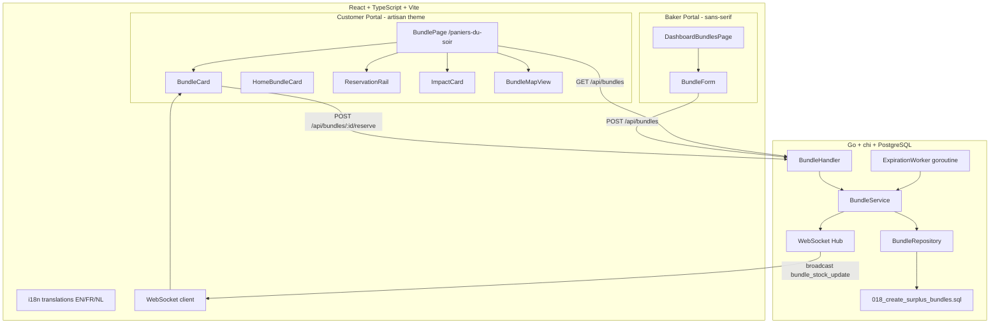
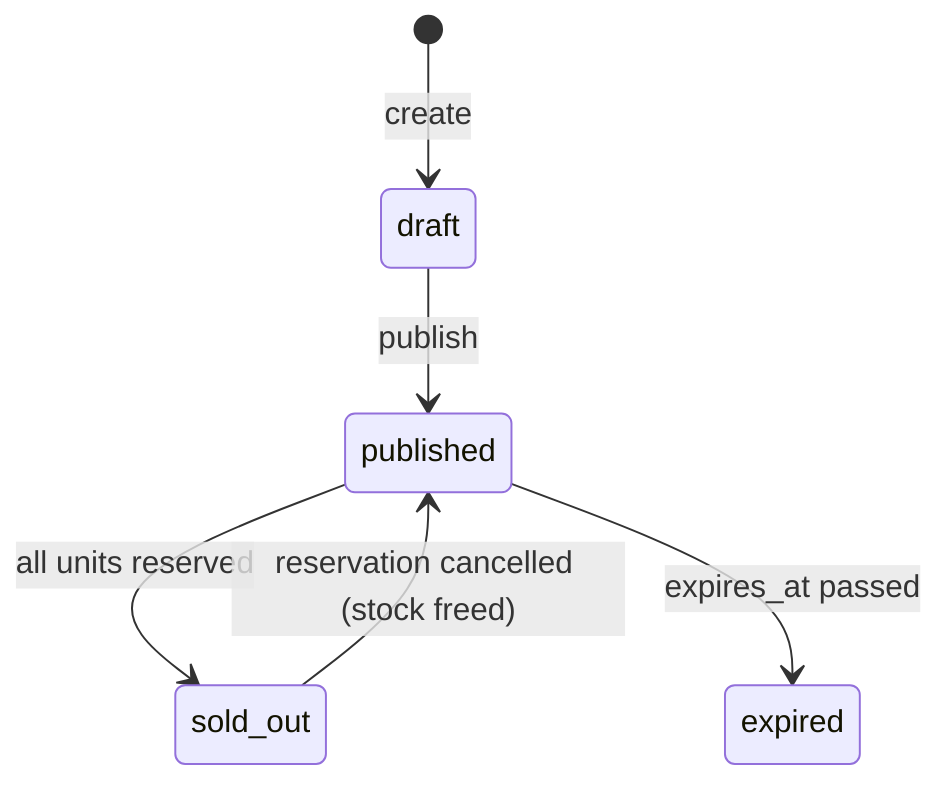
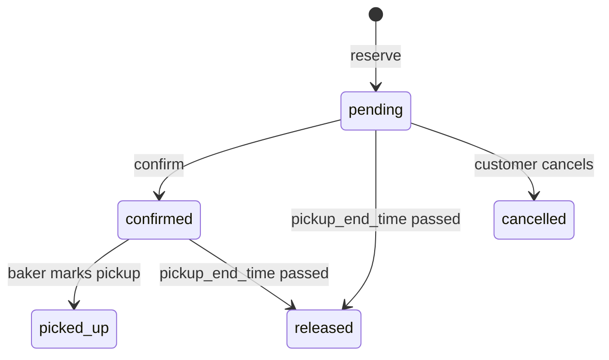

# Design Document: Surplus Boxes (Paniers du Soir)

## Overview

This feature enables bakeries to publish discounted end-of-day surplus boxes and customers to reserve them for pickup before closing. It introduces a new domain (bundles) with its own lifecycle, a reservation system for bundles, real-time stock updates via WebSocket, automatic expiration via a background goroutine, and community impact metrics.

### Key Design Decisions

| Decision | Rationale |
|----------|-----------|
| Separate `surplus_bundles` table (not extending `products`) | Bundles are a distinct concept with their own lifecycle, stock, and expiration — fundamentally different from menu products |
| `surplus_bundle_items` join table for composé contents | Allows referencing existing products or free-text items; normalizes the 1:N relationship |
| `bundle_reservations` table (not reusing `reservations`) | Bundle reservations have different semantics: auto-release on expiry, single-per-bundle constraint, tied to bundle stock |
| Prices in cents (`BIGINT`) | Consistent with existing order/reservation pricing pattern in the codebase |
| Expiration via ticker goroutine (1-minute interval) | Simple, reliable background process; no external scheduler dependency. Status transitions are idempotent |
| WebSocket `Broadcast` for stock updates | All connected clients need to see stock changes, not just specific users |
| Distance computed client-side | Bakery lat/lng already available in API responses; avoids expensive server-side geo queries for filtering |
| Migration `018_create_surplus_bundles.sql` | Next in goose sequence (after 017) |
| Max one active reservation per customer per bundle | Prevents hoarding; enforced via DB unique partial index |

## Architecture



## Components and Interfaces

### Backend (Go)

#### Domain Layer

```go
// internal/domain/bundle.go

// BundleType represents whether the bundle contents are specified or a surprise.
type BundleType string

const (
    BundleTypeCompose  BundleType = "compose"
    BundleTypeSurprise BundleType = "surprise"
)

// BundleStatus represents the lifecycle state of a surplus bundle.
type BundleStatus string

const (
    BundleStatusDraft     BundleStatus = "draft"
    BundleStatusPublished BundleStatus = "published"
    BundleStatusExpired   BundleStatus = "expired"
    BundleStatusSoldOut   BundleStatus = "sold_out"
)

// BundleReservationStatus represents the state of a bundle reservation.
type BundleReservationStatus string

const (
    BundleReservationPending   BundleReservationStatus = "pending"
    BundleReservationConfirmed BundleReservationStatus = "confirmed"
    BundleReservationPickedUp  BundleReservationStatus = "picked_up"
    BundleReservationReleased  BundleReservationStatus = "released"
    BundleReservationCancelled BundleReservationStatus = "cancelled"
)

// SurplusBundle represents a discounted end-of-day package.
type SurplusBundle struct {
    ID                string       `json:"id"`
    BakeryID          string       `json:"bakeryId"`
    Name              string       `json:"name"`
    Type              BundleType   `json:"type"`
    PhotoURL          string       `json:"photoUrl"`
    Description       string       `json:"description"`       // used for surprise type
    EstimatedValue    int64        `json:"estimatedValue"`    // cents, for surprise type
    OriginalPrice     int64        `json:"originalPrice"`     // cents
    DiscountedPrice   int64        `json:"discountedPrice"`   // cents
    QuantityTotal     int          `json:"quantityTotal"`
    QuantityRemaining int          `json:"quantityRemaining"`
    PickupStartTime   TimeOfDay    `json:"pickupStartTime"`
    PickupEndTime     TimeOfDay    `json:"pickupEndTime"`
    PublishedDate     string       `json:"publishedDate"`     // YYYY-MM-DD
    ExpiresAt         time.Time    `json:"expiresAt"`
    Status            BundleStatus `json:"status"`
    Items             []BundleItem `json:"items"`             // populated for compose type
    CreatedAt         time.Time    `json:"createdAt"`
    UpdatedAt         time.Time    `json:"updatedAt"`
}

// BundleItem represents a single item in a composé bundle.
type BundleItem struct {
    ID          string `json:"id"`
    BundleID    string `json:"bundleId"`
    ProductID   string `json:"productId,omitempty"` // optional reference to existing product
    Description string `json:"description"`         // free-text (or product name if productId set)
    Quantity    int    `json:"quantity"`
}

// BundleReservation represents a customer's claim on a surplus bundle.
type BundleReservation struct {
    ID              string                  `json:"id"`
    BundleID        string                  `json:"bundleId"`
    UserID          string                  `json:"userId"`
    Status          BundleReservationStatus `json:"status"`
    CreatedAt       time.Time               `json:"createdAt"`
    UpdatedAt       time.Time               `json:"updatedAt"`
}

// BundleImpact holds community impact metrics.
type BundleImpact struct {
    TotalSaved    int     `json:"totalSaved"`    // bundles picked up this month
    WeightAvoided float64 `json:"weightAvoided"` // kg = totalSaved * 0.5
}
```

#### Service Interface

```go
// internal/domain/services.go (addition)

// BundleFilters holds filtering options for bundle list queries.
type BundleFilters struct {
    Type           *BundleType `json:"type,omitempty"`
    PickupBefore   *TimeOfDay  `json:"pickupBefore,omitempty"`   // filter: pickup_end_time before this
}

// BundleService handles surplus bundle lifecycle and reservations.
type BundleService interface {
    // CreateBundle validates and stores a new bundle in draft status.
    CreateBundle(ctx context.Context, sellerID string, bundle SurplusBundle) (*SurplusBundle, error)

    // PublishBundle transitions a draft bundle to published status.
    PublishBundle(ctx context.Context, sellerID string, bundleID string) (*SurplusBundle, error)

    // ListBundles returns published bundles, optionally filtered.
    ListBundles(ctx context.Context, filters BundleFilters, params PaginationParams) (*ListResult[SurplusBundle], error)

    // GetBundle returns a single bundle by ID.
    GetBundle(ctx context.Context, bundleID string) (*SurplusBundle, error)

    // ReserveBundle creates a reservation for a customer, decrementing stock.
    ReserveBundle(ctx context.Context, customerID string, bundleID string) (*BundleReservation, error)

    // CancelReservation releases the reservation and increments stock.
    CancelReservation(ctx context.Context, customerID string, reservationID string) error

    // ConfirmReservation transitions a pending reservation to confirmed.
    ConfirmReservation(ctx context.Context, customerID string, reservationID string) (*BundleReservation, error)

    // ExpireOverdueBundles finds and expires bundles past their expires_at time.
    // Called by the expiration worker goroutine.
    ExpireOverdueBundles(ctx context.Context) (int, error)

    // ReleaseOverdueReservations releases unconfirmed reservations past pickup_end_time.
    ReleaseOverdueReservations(ctx context.Context) (int, error)

    // GetImpact returns community impact metrics for the current month.
    GetImpact(ctx context.Context) (*BundleImpact, error)
}
```

#### Repository Interface

```go
// internal/domain/repository.go (addition)

// BundleRepository provides data access for surplus bundles and reservations.
type BundleRepository interface {
    // CreateBundle persists a new surplus bundle with its items.
    CreateBundle(ctx context.Context, bundle *SurplusBundle) error

    // UpdateBundle persists changes to a surplus bundle.
    UpdateBundle(ctx context.Context, bundle *SurplusBundle) error

    // GetByID returns a surplus bundle by ID with items, or nil if not found.
    GetByID(ctx context.Context, id string) (*SurplusBundle, error)

    // ListPublished returns published bundles with optional filters and pagination.
    ListPublished(ctx context.Context, filters BundleFilters, params PaginationParams) ([]SurplusBundle, int, error)

    // GetExpiredBundles returns published bundles whose expires_at is in the past.
    GetExpiredBundles(ctx context.Context) ([]SurplusBundle, error)

    // CreateReservation persists a new bundle reservation.
    CreateReservation(ctx context.Context, reservation *BundleReservation) error

    // GetReservation returns a bundle reservation by ID, or nil if not found.
    GetReservation(ctx context.Context, id string) (*BundleReservation, error)

    // GetActiveReservation returns the active reservation (pending/confirmed) for a user+bundle, or nil.
    GetActiveReservation(ctx context.Context, userID string, bundleID string) (*BundleReservation, error)

    // UpdateReservation persists changes to a bundle reservation.
    UpdateReservation(ctx context.Context, reservation *BundleReservation) error

    // GetOverdueReservations returns pending reservations past their bundle's pickup_end_time.
    GetOverdueReservations(ctx context.Context) ([]BundleReservation, error)

    // CountPickedUpThisMonth returns the number of picked-up reservations in the current month.
    CountPickedUpThisMonth(ctx context.Context) (int, error)

    // DecrementStock atomically decrements quantity_remaining by 1. Returns error if already 0.
    DecrementStock(ctx context.Context, bundleID string) error

    // IncrementStock atomically increments quantity_remaining by 1.
    IncrementStock(ctx context.Context, bundleID string) error
}
```

#### API Handler

```go
// internal/api/bundle_handler.go

type BundleHandler struct {
    svc   domain.BundleService
    wsHub *ws.Hub
}

func NewBundleHandler(svc domain.BundleService, wsHub *ws.Hub) *BundleHandler { ... }

// RegisterRoutes registers bundle-related routes.
func (h *BundleHandler) RegisterRoutes(r chi.Router) {
    // Public (customer) routes — require customer/admin JWT
    r.Get("/api/bundles", h.ListBundles)
    r.Get("/api/bundles/{id}", h.GetBundle)
    r.Post("/api/bundles/{id}/reserve", h.ReserveBundle)       // customer role
    r.Post("/api/bundles/{id}/reserve/confirm", h.ConfirmReservation) // customer role
    r.Delete("/api/bundle-reservations/{id}", h.CancelReservation) // customer role
    r.Get("/api/bundles/impact", h.GetImpact)                  // public

    // Seller routes — require seller/admin JWT
    r.Post("/api/bundles", h.CreateBundle)
    r.Post("/api/bundles/{id}/publish", h.PublishBundle)
}
```

#### DTOs

```go
// internal/api/dto/bundle.go

// CreateBundleRequest is the request body for POST /api/bundles.
type CreateBundleRequest struct {
    Name            string              `json:"name"`
    Type            string              `json:"type"`             // "compose" or "surprise"
    PhotoURL        string              `json:"photoUrl"`
    Description     string              `json:"description"`      // required for surprise
    EstimatedValue  int64               `json:"estimatedValue"`   // required for surprise, cents
    OriginalPrice   int64               `json:"originalPrice"`    // cents
    DiscountedPrice int64               `json:"discountedPrice"`  // cents
    QuantityTotal   int                 `json:"quantityTotal"`
    PickupStartTime string              `json:"pickupStartTime"`  // "HH:MM"
    PickupEndTime   string              `json:"pickupEndTime"`    // "HH:MM"
    Items           []BundleItemRequest `json:"items"`            // required for compose
}

type BundleItemRequest struct {
    ProductID   string `json:"productId,omitempty"`
    Description string `json:"description"`
    Quantity    int    `json:"quantity"`
}

// BundleResponse is the response body for bundle endpoints.
type BundleResponse struct {
    ID                string               `json:"id"`
    BakeryID          string               `json:"bakeryId"`
    BakeryName        string               `json:"bakeryName"`
    BakeryLatitude    float64              `json:"bakeryLatitude"`
    BakeryLongitude   float64              `json:"bakeryLongitude"`
    Name              string               `json:"name"`
    Type              string               `json:"type"`
    PhotoURL          string               `json:"photoUrl"`
    Description       string               `json:"description"`
    EstimatedValue    int64                `json:"estimatedValue"`
    OriginalPrice     int64                `json:"originalPrice"`
    DiscountedPrice   int64                `json:"discountedPrice"`
    QuantityTotal     int                  `json:"quantityTotal"`
    QuantityRemaining int                  `json:"quantityRemaining"`
    PickupStartTime   string               `json:"pickupStartTime"`
    PickupEndTime     string               `json:"pickupEndTime"`
    PublishedDate     string               `json:"publishedDate"`
    ExpiresAt         string               `json:"expiresAt"`
    Status            string               `json:"status"`
    Items             []BundleItemResponse `json:"items"`
    CreatedAt         string               `json:"createdAt"`
}

type BundleItemResponse struct {
    ProductID   string `json:"productId,omitempty"`
    Description string `json:"description"`
    Quantity    int    `json:"quantity"`
}

// BundleReservationResponse is the response for reservation endpoints.
type BundleReservationResponse struct {
    ID         string `json:"id"`
    BundleID   string `json:"bundleId"`
    BundleName string `json:"bundleName"`
    Status     string `json:"status"`
    CreatedAt  string `json:"createdAt"`
}

// BundleImpactResponse is the response for GET /api/bundles/impact.
type BundleImpactResponse struct {
    TotalSaved    int     `json:"totalSaved"`
    WeightAvoided float64 `json:"weightAvoided"`
}
```

#### WebSocket Events

```go
// Broadcast to all clients when stock changes
ws.Event{
    Type: "bundle_stock_update",
    Payload: map[string]interface{}{
        "bundleId":          bundleID,
        "quantityRemaining": newQuantity,
        "status":            newStatus, // "published", "sold_out"
    },
}

// Broadcast when a bundle expires
ws.Event{
    Type: "bundle_expired",
    Payload: map[string]interface{}{
        "bundleId": bundleID,
    },
}
```

#### Expiration Worker

```go
// internal/service/bundle_expiration.go

// StartExpirationWorker starts a background goroutine that periodically
// expires overdue bundles and releases overdue reservations.
// It runs every 60 seconds and stops when ctx is cancelled.
func StartExpirationWorker(ctx context.Context, svc domain.BundleService, hub *ws.Hub) {
    ticker := time.NewTicker(60 * time.Second)
    defer ticker.Stop()

    for {
        select {
        case <-ctx.Done():
            return
        case <-ticker.C:
            // Expire bundles
            expired, _ := svc.ExpireOverdueBundles(ctx)
            // Release overdue reservations
            released, _ := svc.ReleaseOverdueReservations(ctx)
            if expired > 0 || released > 0 {
                log.Printf("[BUNDLE-EXPIRY] expired=%d bundles, released=%d reservations", expired, released)
            }
        }
    }
}
```

### Frontend (React + TypeScript)

#### Types

```typescript
// src/types/bundle.ts

export type BundleType = 'compose' | 'surprise';
export type BundleStatus = 'draft' | 'published' | 'expired' | 'sold_out';
export type BundleReservationStatus = 'pending' | 'confirmed' | 'picked_up' | 'released' | 'cancelled';

export interface BundleItem {
  productId?: string;
  description: string;
  quantity: number;
}

export interface Bundle {
  id: string;
  bakeryId: string;
  bakeryName: string;
  bakeryLatitude: number;
  bakeryLongitude: number;
  name: string;
  type: BundleType;
  photoUrl: string;
  description: string;
  estimatedValue: number; // cents
  originalPrice: number;  // cents
  discountedPrice: number; // cents
  quantityTotal: number;
  quantityRemaining: number;
  pickupStartTime: string; // "HH:MM"
  pickupEndTime: string;   // "HH:MM"
  publishedDate: string;
  expiresAt: string;
  status: BundleStatus;
  items: BundleItem[];
  createdAt: string;
}

export interface BundleReservation {
  id: string;
  bundleId: string;
  bundleName: string;
  status: BundleReservationStatus;
  createdAt: string;
}

export interface BundleImpact {
  totalSaved: number;
  weightAvoided: number;
}

export interface BundleFilters {
  type?: BundleType;
  pickupBefore?: string; // "HH:MM"
  maxDistance?: number;   // meters, applied client-side
}
```

#### API Client

```typescript
// src/api/bundles.ts

import { client } from './client';
import type { Bundle, BundleReservation, BundleImpact } from '../types/bundle';
import type { ListResponse } from '../types/bakery';

export function listBundles(params?: {
  page?: number;
  type?: string;
  pickupBefore?: string;
}): Promise<ListResponse<Bundle>> { ... }

export function getBundle(id: string): Promise<Bundle> { ... }

export function reserveBundle(id: string): Promise<BundleReservation> { ... }

export function confirmReservation(bundleId: string): Promise<BundleReservation> { ... }

export function cancelBundleReservation(id: string): Promise<void> { ... }

export function getBundleImpact(): Promise<BundleImpact> { ... }

// Seller
export function createBundle(data: CreateBundleRequest): Promise<Bundle> { ... }

export function publishBundle(id: string): Promise<Bundle> { ... }
```

#### Hooks

```typescript
// src/hooks/useBundles.ts
export function useBundles(filters: BundleFilters): UseQueryResult<ListResponse<Bundle>> { ... }
export function useBundle(id: string): UseQueryResult<Bundle> { ... }
export function useBundleImpact(): UseQueryResult<BundleImpact> { ... }
export function useReserveBundle(): UseMutationResult { ... }
export function useConfirmReservation(): UseMutationResult { ... }
export function useCancelBundleReservation(): UseMutationResult { ... }
```

#### Components

| Component | Description |
|-----------|-------------|
| `BundlePage` | Full page at `/paniers-du-soir`. Header, filter bar, list/map toggle, bundle grid, impact card, footer note |
| `BundleCard` | Card displaying a single bundle: photo, name, type badge, bakery name, distance, pickup window, contents/value, pricing, stock badge, reserve button |
| `HomeBundleCard` | Summary card on home page: shows nearest bundle expanded + up to 3 compact bundles + "Voir tous les paniers →" link |
| `ReservationRail` | Sidebar panel showing active reservation: bundle name, price, pickup window, payment info, confirm button, warning message |
| `ImpactCard` | Metrics card: total saved this month, estimated weight avoided |
| `BundleMapView` | Leaflet/Mapbox map showing bundle locations with markers. Clicking a marker scrolls to the bundle card |
| `BundleForm` | Baker form for creating bundles: name, type selector, items (for composé), description/value (for surprise), pricing, quantity, pickup window |

## Data Models

### Database Migration: `018_create_surplus_bundles.sql`

```sql
-- +goose Up

-- Surplus bundles table
CREATE TABLE surplus_bundles (
    id UUID PRIMARY KEY DEFAULT uuid_generate_v4(),
    bakery_id UUID NOT NULL REFERENCES bakeries(id) ON DELETE CASCADE,
    name VARCHAR(100) NOT NULL,
    type VARCHAR(20) NOT NULL CHECK (type IN ('compose', 'surprise')),
    photo_url VARCHAR(500),
    description VARCHAR(200),           -- used for surprise type
    estimated_value BIGINT,             -- cents, used for surprise type
    original_price BIGINT NOT NULL CHECK (original_price > 0),
    discounted_price BIGINT NOT NULL CHECK (discounted_price > 0),
    quantity_total INT NOT NULL CHECK (quantity_total >= 1),
    quantity_remaining INT NOT NULL CHECK (quantity_remaining >= 0),
    pickup_start_time TIME NOT NULL,
    pickup_end_time TIME NOT NULL,
    published_date DATE,
    expires_at TIMESTAMP,
    status VARCHAR(20) NOT NULL DEFAULT 'draft'
        CHECK (status IN ('draft', 'published', 'expired', 'sold_out')),
    created_at TIMESTAMP NOT NULL DEFAULT NOW(),
    updated_at TIMESTAMP NOT NULL DEFAULT NOW(),

    -- Business rule constraints
    CONSTRAINT chk_bundle_discount CHECK (discounted_price < original_price),
    CONSTRAINT chk_bundle_pickup_window CHECK (pickup_start_time < pickup_end_time),
    CONSTRAINT chk_bundle_stock CHECK (quantity_remaining <= quantity_total)
);

CREATE INDEX idx_surplus_bundles_bakery_id ON surplus_bundles(bakery_id);
CREATE INDEX idx_surplus_bundles_status ON surplus_bundles(status);
CREATE INDEX idx_surplus_bundles_status_expires ON surplus_bundles(status, expires_at)
    WHERE status = 'published';
CREATE INDEX idx_surplus_bundles_published_date ON surplus_bundles(published_date DESC)
    WHERE status = 'published';

-- Bundle items for composé bundles
CREATE TABLE surplus_bundle_items (
    id UUID PRIMARY KEY DEFAULT uuid_generate_v4(),
    bundle_id UUID NOT NULL REFERENCES surplus_bundles(id) ON DELETE CASCADE,
    product_id UUID REFERENCES products(id) ON DELETE SET NULL,
    description VARCHAR(200) NOT NULL,
    quantity INT NOT NULL CHECK (quantity >= 1)
);

CREATE INDEX idx_surplus_bundle_items_bundle_id ON surplus_bundle_items(bundle_id);

-- Bundle reservations
CREATE TABLE bundle_reservations (
    id UUID PRIMARY KEY DEFAULT uuid_generate_v4(),
    bundle_id UUID NOT NULL REFERENCES surplus_bundles(id) ON DELETE CASCADE,
    user_id UUID NOT NULL,
    status VARCHAR(20) NOT NULL DEFAULT 'pending'
        CHECK (status IN ('pending', 'confirmed', 'picked_up', 'released', 'cancelled')),
    created_at TIMESTAMP NOT NULL DEFAULT NOW(),
    updated_at TIMESTAMP NOT NULL DEFAULT NOW()
);

CREATE INDEX idx_bundle_reservations_bundle_id ON bundle_reservations(bundle_id);
CREATE INDEX idx_bundle_reservations_user_id ON bundle_reservations(user_id);
CREATE INDEX idx_bundle_reservations_status ON bundle_reservations(status);

-- Enforce max one active reservation per customer per bundle
CREATE UNIQUE INDEX idx_bundle_reservations_active_unique
    ON bundle_reservations(user_id, bundle_id)
    WHERE status IN ('pending', 'confirmed');

-- +goose Down
DROP TABLE IF EXISTS bundle_reservations;
DROP TABLE IF EXISTS surplus_bundle_items;
DROP TABLE IF EXISTS surplus_bundles;
```

### Status Lifecycle Diagrams






## Correctness Properties

*A property is a characteristic or behavior that should hold true across all valid executions of a system — essentially, a formal statement about what the system should do. Properties serve as the bridge between human-readable specifications and machine-verifiable correctness guarantees.*

### Property 1: Bundle data round-trip

*For any* valid surplus bundle (compose with random items, or surprise with description/estimated_value), creating the bundle and then fetching it by ID SHALL return an equivalent bundle with all fields preserved — including name, type, prices, quantities, pickup times, items (for composé), and description/estimated_value (for surprise).

**Validates: Requirements 1.1, 1.2, 1.3**

### Property 2: Price ordering constraint

*For any* pair of integers (original_price, discounted_price) where discounted_price >= original_price OR discounted_price <= 0, attempting to create a bundle SHALL be rejected with a validation error. Conversely, for any pair where 0 < discounted_price < original_price, creation SHALL succeed.

**Validates: Requirements 1.4, 10.4, 10.5**

### Property 3: Pickup window constraint

*For any* pair of times (pickup_start_time, pickup_end_time) where pickup_start_time >= pickup_end_time, attempting to create a bundle SHALL be rejected with a validation error. For any pair where pickup_start_time < pickup_end_time, the time window SHALL be accepted.

**Validates: Requirements 1.5**

### Property 4: Stock invariant preserved through operations

*For any* bundle with quantity_total = N and *for any* sequence of reserve and cancel operations, the quantity_remaining SHALL always satisfy 0 <= quantity_remaining <= quantity_total. Specifically: each successful reservation decrements quantity_remaining by exactly 1, and each cancellation or release increments it by exactly 1.

**Validates: Requirements 1.6, 4.1, 4.9**

### Property 5: Draft status on creation

*For any* valid bundle creation request, the resulting bundle SHALL have status "draft" and quantity_remaining equal to quantity_total.

**Validates: Requirements 2.1**

### Property 6: Publish transitions to published with correct expires_at

*For any* draft bundle belonging to a bakery with a defined closing time on the bundle's published_date, publishing the bundle SHALL set status to "published" and set expires_at to the bakery's closing time on that date.

**Validates: Requirements 2.2, 2.3**

### Property 7: Expiration transitions and reservation release

*For any* published bundle whose expires_at is in the past, running the expiration worker SHALL transition the bundle to "expired" status. Furthermore, *for any* pending or confirmed reservations on that bundle, they SHALL be released and quantity_remaining SHALL be incremented by the number of released reservations.

**Validates: Requirements 2.4, 7.1, 7.2**

### Property 8: Sold-out transition

*For any* published bundle, when the total number of active (non-cancelled, non-released) reservations equals quantity_total, the bundle status SHALL be "sold_out". If a reservation is subsequently cancelled, the status SHALL revert to "published".

**Validates: Requirements 2.5, 3.7**

### Property 9: Zero-stock reservation rejection

*For any* bundle with quantity_remaining equal to zero, *for any* customer attempting to reserve it, the system SHALL reject the reservation with an appropriate error and the bundle state SHALL remain unchanged.

**Validates: Requirements 4.5**

### Property 10: One active reservation per customer per bundle

*For any* customer who already has a pending or confirmed reservation on a specific bundle, attempting to create a second reservation on the same bundle SHALL be rejected, and the existing reservation SHALL remain unchanged.

**Validates: Requirements 4.8**

### Property 11: Filter correctness

*For any* set of published bundles and *for any* filter combination (type filter, pickup_before filter), the returned results SHALL contain only bundles matching ALL applied filters, and SHALL contain ALL published bundles that match the filters.

**Validates: Requirements 3.2, 3.3, 3.4, 3.5**

### Property 12: Impact metrics consistency

*For any* set of bundle reservations with status "picked_up" created in the current month, the impact endpoint SHALL return totalSaved equal to the count of such reservations, and weightAvoided equal to totalSaved multiplied by 0.5.

**Validates: Requirements 6.1, 6.2**

### Property 13: Translation completeness for bundle UI

*For any* bundle-related i18n key (type labels, filter labels, status badges, action buttons, informational messages) and *for any* supported locale (EN, FR, NL), the i18n system SHALL contain a non-empty translation string.

**Validates: Requirements 9.1, 9.2**

## Error Handling

| Scenario | Layer | HTTP Status | Code | Behavior |
|----------|-------|-------------|------|----------|
| Missing required fields in create bundle | Backend handler | 400 | `VALIDATION_ERROR` | Return field-specific error messages |
| discounted_price >= original_price | Backend handler | 400 | `INVALID_PRICE` | "Discounted price must be less than original price" |
| discounted_price <= 0 | Backend handler | 400 | `INVALID_PRICE` | "Discounted price must be greater than zero" |
| pickup_start_time >= pickup_end_time | Backend handler | 400 | `INVALID_PICKUP_WINDOW` | "Pickup start time must be before end time" |
| Bundle not found | Backend handler | 404 | `BUNDLE_NOT_FOUND` | "Bundle not found" |
| Reserve on sold-out bundle | Backend handler | 409 | `BUNDLE_SOLD_OUT` | "Bundle is sold out" |
| Duplicate active reservation | Backend handler | 409 | `RESERVATION_EXISTS` | "You already have an active reservation for this bundle" |
| Publish non-draft bundle | Backend handler | 409 | `INVALID_STATUS_TRANSITION` | "Only draft bundles can be published" |
| Cancel already-released/picked-up reservation | Backend handler | 409 | `RESERVATION_NOT_CANCELLABLE` | "Reservation cannot be cancelled in its current state" |
| Confirm non-pending reservation | Backend handler | 409 | `INVALID_STATUS_TRANSITION` | "Only pending reservations can be confirmed" |
| Unauthorized (no JWT) | Middleware | 401 | `UNAUTHORIZED` | "Authentication required" |
| Forbidden (wrong role) | Middleware | 403 | `FORBIDDEN` | "Insufficient permissions" |
| Seller not owning bakery tries to publish | Backend handler | 403 | `FORBIDDEN` | "You do not own this bakery" |
| Race condition on reserve (stock 0 at DB level) | Backend handler | 409 | `BUNDLE_SOLD_OUT` | "Bundle is no longer available" |
| Database error | Backend service | 500 | `INTERNAL_ERROR` | Log error, return generic message |
| WebSocket broadcast failure | Backend service | — | — | Log warning, do not fail the operation |
| API error on reserve (frontend) | Frontend | — | — | Show toast error, refresh stock display |
| Network error loading bundles | Frontend | — | — | Show retry button with error message |

## Testing Strategy

### Unit Tests (Example-based)

**Backend (Go):**
- Bundle validation: missing fields, invalid types, edge cases (empty name, quantity 0)
- Status transitions: valid and invalid transition attempts
- Expiration worker: mocked time, verify correct bundles are expired
- Handler routing: auth checks, role enforcement

**Frontend (React + TypeScript):**
- `BundleCard` renders all elements for composé and surprise types
- `BundleCard` renders sold-out state correctly (dimmed, badge, disabled button)
- `ReservationRail` displays reservation details, warning, and payment method
- `HomeBundleCard` shows/hides based on bundle availability
- `ImpactCard` renders metrics with correct formatting
- `BundleForm` validates required fields per bundle type
- WebSocket message handler updates bundle stock in React state

### Property-Based Tests

Property-based testing is appropriate for this feature because:
- Price/time validation involves boundary checking across numeric/time ranges
- Stock invariants must hold through arbitrary sequences of reserve/cancel operations
- Filter correctness must hold for any combination of bundle attributes and filter criteria
- Round-trip properties verify data integrity across the full stack
- Impact metrics involve simple arithmetic that should hold universally

**Library:** [rapid](https://github.com/flyingmutant/rapid) (Go) for backend properties

**Configuration:**
- Minimum 100 iterations per property
- Each test tagged with: `Feature: surplus-boxes, Property {N}: {title}`

**Properties to implement:**
1. Bundle data round-trip (Property 1)
2. Price ordering constraint (Property 2)
3. Pickup window constraint (Property 3)
4. Stock invariant through operations (Property 4)
5. Draft status on creation (Property 5)
6. Expiration transitions and reservation release (Property 7)
7. Zero-stock reservation rejection (Property 9)
8. One active reservation per customer per bundle (Property 10)
9. Filter correctness (Property 11)
10. Impact metrics consistency (Property 12)
11. Translation completeness (Property 13)

Frontend properties (Property 8 sold-out transition display, Property 6 publish behavior) are better tested as example-based tests since they involve UI rendering or require bakery schedule context that's more naturally tested with specific scenarios.

### Integration Tests

- Full API flow: create bundle → publish → reserve → confirm → verify stock updates
- Expiration E2E: create bundle with short expiry → wait → verify expired
- WebSocket integration: reserve → verify broadcast event received by client
- Migration test: apply 018 on seeded DB, verify tables/constraints
- Baker portal E2E: create composé bundle → publish → verify visible to customers
