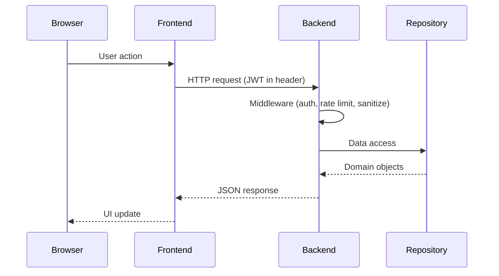
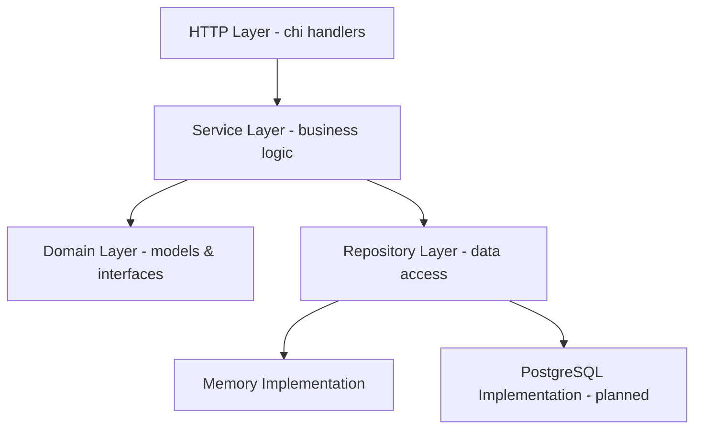

# 🏗️ Architecture

## Monorepo Structure

```
mb/
├── cmd/
│   ├── server/          # Main application entry point + seed data
│   └── gentoken/        # CLI tool to generate registration tokens
├── internal/
│   ├── domain/          # Domain models, enums, interfaces
│   ├── api/             # HTTP handlers (chi)
│   │   └── dto/         # Data transfer objects
│   ├── service/         # Business logic layer
│   ├── repository/
│   │   └── memory/      # In-memory repository implementations
│   ├── middleware/      # JWT auth, rate limiting, sanitization
│   ├── payment/         # Payment gateway (stub)
│   └── validation/      # Order/availability validation
├── frontend/            # React 19 + TypeScript + Vite
│   └── src/
├── db/
│   └── migrations/      # PostgreSQL migrations (goose)
├── e2e/                 # Playwright E2E tests
├── docs/                # Documentation
└── Makefile             # Build, test, lint commands
```

---

## Tech Stack

| Layer | Technology |
|-------|-----------|
| Backend | Go · chi router · JWT (golang-jwt) |
| Frontend | React 19 · TypeScript · Vite 8 |
| Database | PostgreSQL (schema) · In-memory (runtime) |
| Maps | Leaflet · react-leaflet |
| Charts | Recharts |
| E2E Tests | Playwright |
| Property Tests | pgregory.net/rapid (Go) · fast-check (TS) |

---

## Request Flow



---

## Layer Separation



### Principles

1. **Domain** defines models and repository interfaces — no external dependencies
2. **Service** contains business rules and orchestrates repositories
3. **Handler** translates HTTP to service calls, handles serialization
4. **Repository** implements data access behind interfaces (swappable)

---

## Communication

- Frontend ↔ Backend: **REST API** over HTTP
- Auth: **JWT Bearer tokens** in `Authorization` header
- CORS: configured for frontend origin only
- No WebSocket (planned for notifications)

---

## State Management

- **Backend**: Stateless HTTP handlers, in-memory repositories hold state
- **Frontend**: React hooks (useState, useEffect) — no Redux or external state library
- **Auth state**: JWT stored in localStorage, decoded client-side for role checks
